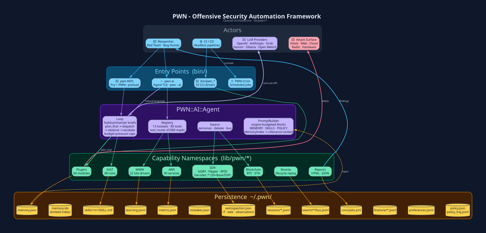
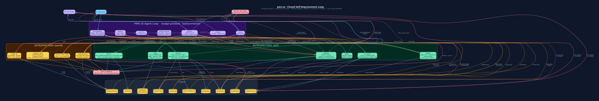
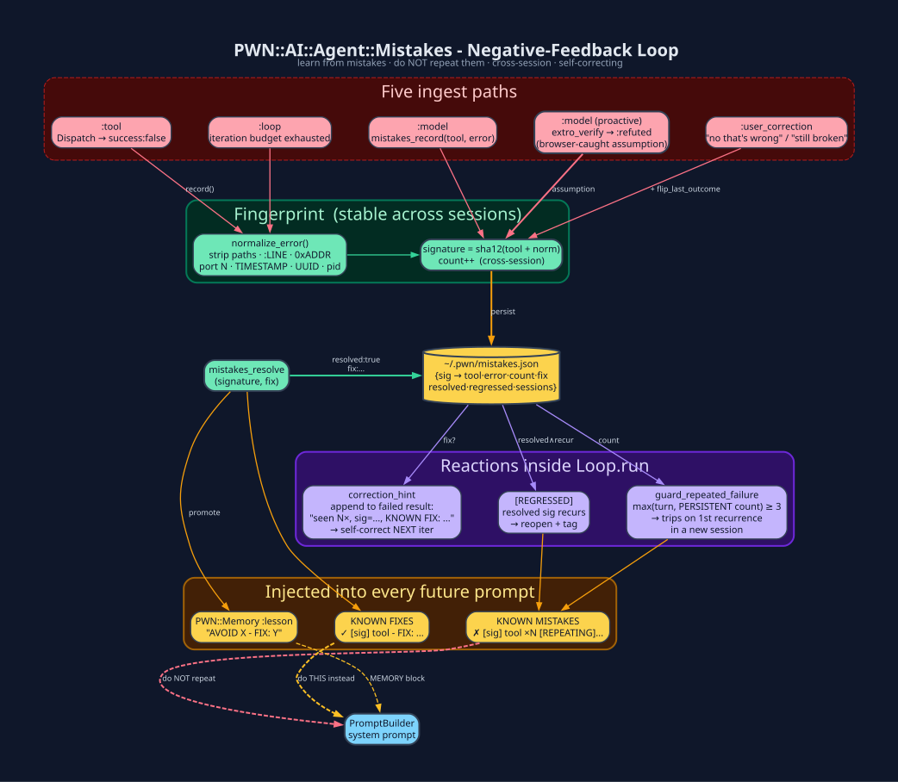
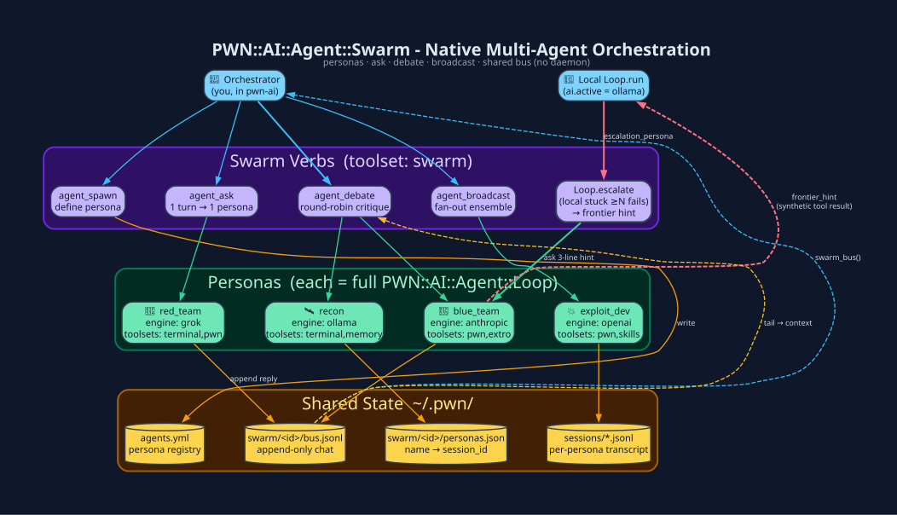

<!--  -->

<p align="center">
  
</p>

### **Table of Contents** ###

- [Intro](#intro)
  * [What is PWN](#what-is-pwn)
  * [Why PWN](#why-pwn)
  * [How PWN Works](#how-pwn-works)
- [Documentation](#documentation)
- [Installation](#installation)
- [General Usage](#general-usage)
- [Call to Arms](#call-to-arms)
- [Module Documentation](#module-documentation)
- [Keep Us Caffeinated](#keep-us-caffeinated)
- [0x004D65726368](#0x004d65726368)

---

### **Intro** ###

#### **What is PWN** ####

PWN (pronounced *pone*, like "own" with a p) is an open-source Ruby toolkit for
**offensive security automation**. One workspace ties together the tools you
already use: OSINT, network scanning, web and cloud testing, hardware and
radio, reporting, and disclosure. A **tool-calling AI agent** sits on top and
can run those same methods for you.

Red teamers, pentesters, and vulnerability researchers get one place to script
and automate instead of gluing together a pile of separate CLIs.

**In numbers:** 66 `PWN::Plugins` · 48 `PWN::SAST` rules · 90 `PWN::AWS`
service wrappers · 21 `PWN::WWW` site drivers · 53 `bin/pwn_*` CLI drivers ·
6 LLM engines · 12 agent toolsets · 82 LLM-callable tools.

Full page: [What is PWN](documentation/What-is-PWN.md)

#### **Why PWN** ####

Here's what `grok-4.5` has to say about pwn (more specifically `pwn-ai`):
```
pwn.ai:grok/grok-4.5/0:500K[CURRENT_VERSION]:002 >>> Briefly describe your take on the reinforced learning feedback loop implemented within `pwn-ai` in clear, concise English so that a human understands your response.

[ <TIMESTAMP> → pwn-ai → task ]   Goal: Briefly describe your take on the reinforced learning feedback loop implemented within `pwn-ai` in clear, concise English so that a human understands your response.
  Tangible tasks (6) - each task may use one or more tools to complete its objective(s):
    task 1/6: Review available knowledge of pwn-ai architecture and any reinforced learning elements
    task 2/6: Identify the key stages of the feedback loop used for reinforcement
    task 3/6: Summarize how actions, rewards, and model updates connect in that loop
    task 4/6: Draft a brief plain-English explanation of the overall take on the loop
    task 5/6: Refine the draft for clarity and conciseness suitable for a human reader
    task 6/6: Present the final short description

... performs tasks ...

**My take, in plain English:**

pwn-ai's reinforced learning loop is less a classic offline RL trainer and more a living, multi-store control system wrapped around an agent turn. My take is that it is one of the more complete in-context self-improvement stacks I've seen in an agent harness, and also that its real power and its main failure modes come from the same place: it learns loudly in the prompt long before it learns quietly in weights.

## Bottom line

My take: pwn-ai implements a **closed-loop, dual-horizon, self-and-world-aware reinforcement system** around an LLM agent. The clever part is not that it has a reward model. The clever part is that it treats agent work as an ongoing control problem with:

- fast aversive conditioning (Mistakes),
- value estimates for actions (Metrics),
- episode scoring and replay (Learning/Reward),
- deliberate practice (Curriculum),
- and an external reality check (Extrospection),
- with a slower supervised/DPO hatch only when the diet and gates look sane.

It feels less like "fine-tune the model forever" and more like giving the agent a nervous system: pain, habit, memory, practice, and a rudimentary sense of whether the world changed. That is why it can improve overnight on a host with no trainer. It is also why health has to be measured by judge gap, repeating-mistake trend, trajectory fraction, and resolved scars rather than by tool success_rate alone.
```

Offensive work is hard because the *tools* do not fit together. PWN's fix is
simple: every capability is a ruby module that can be used with other modules to produce
a diverse set of security "drivers". That one idea means the *same* code runs:

- live in the REPL
- from an LLM agent in a tool loop
- in a shell script or CI job
- on a cron schedule while you sleep

The whole stack is open source and easy to read. That matters when software
is driving security decisions without you watching every click.

Full page: [Why PWN](documentation/Why-PWN.md)

#### **How PWN Works** ####

PWN is five layers. Dependencies only point downward, so each level stays
small and easy to swap:



On every turn the AI layer runs a **feedback loop**. It checks inward
(Metrics, Learning, and **Mistakes**: what failed last time) and outward
(Snapshot, Drift, Intel, RF, and **Web**: did the host or network change?).
Live checks use browser-backed **`extro_verify`** / **`extro_watch`** and RF
**`extro_rf_tune`**. `extro_correlate` joins those views so the agent can tell
*"I messed up"* from *"the world moved"*, and **does not repeat the same
mistake**:



Failures are fingerprinted across sessions (`~/.pwn/mistakes.json`), tagged
`[REPEATING]` / `[REGRESSED]`, and when the same slip shows up again the saved
**fix** is dropped straight back into the prompt:



**Swarm** runs several personas at once. Each is a full tool-calling agent,
optionally on a *different* LLM engine, talking over a shared append-only
message bus:



Long-running turns also show **executive task briefs** (not raw commands) via
`TaskSummarizer`. Every request is first classified as a **general statement**,
a **question**, or an **autonomous goal**. Only autonomous goals get a multi-step
breakdown on submit (`emit_plan!`); statements and questions stay single-turn.
Per-batch `about_to` lines use `tool_counts_phrase` + `intent_phrase` with
`last_brief_fp` duplicate suppression. When recent turns keep hitting the iteration ceiling, the Loop tightens the remaining runway (lower `max_iters` on local engines, text-only tail, no counterfactual fork) so the agent still finishes instead of thrashing.

Full pages: [How PWN Works](documentation/How-PWN-Works.md) ·
[All data-flow diagrams](documentation/Diagrams.md)

---

### **Documentation** ###

The complete wiki lives in this repo at **[`documentation/Home.md`](documentation/Home.md)**.

| Start Here | Entry Points | AI Subsystem | Capabilities |
|---|---|---|---|
| [What is PWN](documentation/What-is-PWN.md) | [`pwn` REPL](documentation/pwn-REPL.md) | [AI / LLM Integration](documentation/AI-Integration.md) | [Plugins (66)](documentation/Plugins.md) |
| [Why PWN](documentation/Why-PWN.md) | [`pwn-ai` Agent](documentation/pwn-ai-Agent.md) | [Agent Tool Registry](documentation/Agent-Tool-Registry.md) | [SAST (48)](documentation/SAST.md) |
| [How PWN Works](documentation/How-PWN-Works.md) | [CLI Drivers (53)](documentation/CLI-Drivers.md) | [Memory · Skills · Learning](documentation/Skills-Memory-Learning.md) | [AWS (90)](documentation/AWS.md) |
| [Installation](documentation/Installation.md) | [Build a Driver](documentation/Drivers.md) | [Mistakes (neg-feedback)](documentation/Mistakes.md) | [WWW (21)](documentation/WWW.md) |
| [General Usage](documentation/General-PWN-Usage.md) | | [Extrospection](documentation/Extrospection.md) | [SDR / Radio](documentation/SDR.md) |
| [Configuration](documentation/Configuration.md) | | [Swarm (multi-agent)](documentation/Swarm.md) | [Hardware](documentation/Hardware.md) |
| [`~/.pwn/` Persistence](documentation/Persistence.md) | | [Sessions](documentation/Sessions.md) · [Cron](documentation/Cron.md) | [Reports](documentation/Reporting.md) |
| **[All Diagrams](documentation/Diagrams.md)** (29) | | | [BurpSuite](documentation/BurpSuite.md) · [NmapIt](documentation/NmapIt.md) |
| [Troubleshooting](documentation/Troubleshooting.md) | | | [Metasploit](documentation/Metasploit.md) · [Fuzzing](documentation/Fuzzing.md) |
| [Contributing](documentation/Contributing.md) | | | [Blockchain](documentation/Blockchain.md) · [Bounty](documentation/Bounty.md) |
| | | | [FFI](documentation/FFI.md) · [Banner](documentation/Banner.md) |

Rebuild every SVG from its Graphviz source:
`cd documentation/diagrams && ./build.sh`

---

### **Installation** ###

PWN is a **single gem** with a built-in post-install doctor/provisioner -
`pwn setup` - that detects your package manager (`apt` · `dnf` · `pacman` ·
`brew` · `port`) and installs the OS headers and external tools each
`PWN::` capability needs. Tested on Kali/Debian/Ubuntu, Fedora, Arch, macOS.

```
$ gem install pwn
$ pwn setup                        # read-only doctor: which capabilities are usable?
$ pwn setup --profile full --yes   # provision everything (or: web | net | sdr | vision | ...)
$ pwn
pwn[CURRENT_VERSION]:001 >>> PWN.help
```

Only need a subset?

```
$ pwn setup --list-profiles
$ pwn setup --profile web          # TransparentBrowser · Burp · ZAP · Tor · sqlmap
$ pwn setup --profile sdr --yes    # GQRX · rtl-sdr · hackrf · SoapySDR · FFI DSP
$ pwn setup --profile net --dry-run
```

Also available as `pwn_setup` (standalone driver) and `pwn --setup[=PROFILE]`.
The doctor exits non-zero when capabilities are degraded, so CI can gate on it.

<!--[](https://youtu.be/G7iLUY4FzsI)-->

Full page: [Installation](documentation/Installation.md) ·
[Configuration](documentation/Configuration.md)

---

### **General Usage** ###

[General Usage Quick-Start](https://github.com/0dayinc/pwn/wiki/General-PWN-Usage) ·
local: [General PWN Usage](documentation/General-PWN-Usage.md)

Update PWN frequently - new plugins, agent tools, skills and zero-day tooling
land regularly:

```
$ gem update pwn
$ pwn setup            # re-doctor - new versions may add capabilities
$ pwn
pwn[CURRENT_VERSION]:001 >>> PWN.help
```

From a git checkout:

```
$ cd /opt/pwn && git pull && rake install && pwn setup
```

**Inside the `pwn` REPL:**
- Full access to every `PWN::` module.
- `pwn-ai` - launch the autonomous agent TUI (SHIFT+ENTER newline, ENTER submit).
- `pwn-asm`, `pwn-ai-memory`, `pwn-ai-sessions`, `pwn-ai-cron`, `pwn-ai-delegate`.

**Headless / CI one-shot (`pwn --ai`):**

```
$ pwn --ai 'What ports are listening on this host?'
$ echo "$LONG_PROMPT" | pwn --ai -
$ pwn -Y ./ci/pwn.yaml --ai 'Run pwn_sast against ./src and summarize HIGH findings' > findings.txt
```

**Provision a CI runner / Docker image:**

```
$ pwn setup --profile web --yes && pwn setup --check   # exits 1 if degraded
```

---

### **Call to Arms** ###

Contributions that expand PWN's offensive capabilities are welcome. If you can
provide access to additional commercial LLMs, security scanners, or bounty
platforms - or wish to contribute plugins, AI skills, or exploit modules -
please [email us](mailto:support@0dayinc.com). See
[CONTRIBUTING.md](https://github.com/0dayInc/pwn/blob/master/CONTRIBUTING.md)
and the local [Contributing](documentation/Contributing.md) page.

---

### **Module Documentation** ###

**Primary:** [`documentation/Home.md`](documentation/Home.md) - the full local
wiki with 30+ pages and 29 SVG data-flow diagrams.

**API reference:** [rubydoc.info/gems/pwn](https://www.rubydoc.info/gems/pwn),
or in-REPL: `PWN::Plugins::BurpSuite.help`, `show-source`, `ls`.

Highlights:
[Plugins](documentation/Plugins.md) ·
[BurpSuite](documentation/BurpSuite.md) ·
[Transparent-Browser](documentation/Transparent-Browser.md) ·
[pwn-ai Agent](documentation/pwn-ai-Agent.md) ·
[Swarm](documentation/Swarm.md) ·
[Extrospection](documentation/Extrospection.md) ·
[SAST](documentation/SAST.md) ·
[AI Integration](documentation/AI-Integration.md)

Remember: **always have permission** before any security testing. Then go
pwn all the things (responsibly).

---

### **Keep Us Caffeinated** ###
If this project helped you and you want to support the work, keep us caffeinated:

[](https://buymeacoff.ee/0dayinc)


### [**0x004D65726368**](https://0day.myspreadshop.com/) ###

[](https://0day.myspreadshop.com/stickers)

[](https://0day.myspreadshop.com/accessories+mugs+%26+drinkware)

[](https://0day.myspreadshop.com/accessories)

[](https://shop.spreadshirt.com/0day/0dayinc-A5c3e498cf937643162a01b5f?productType=951&appearance=70)

[](https://shop.spreadshirt.com/0day/blackfingerprint-A5c3e49db1cbf3a0b9596b4d0?productType=111&appearance=2)
