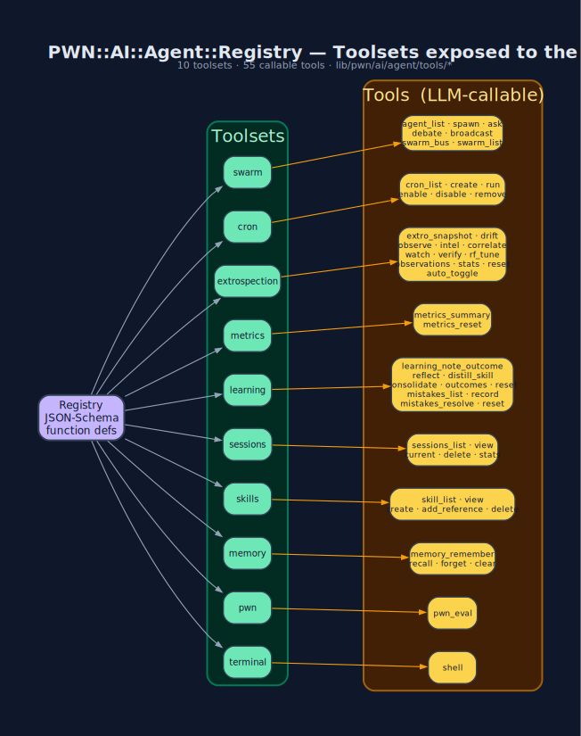

# Agent Tool Registry

`PWN::AI::Agent::Registry` (`lib/pwn/ai/agent/registry.rb`) collects every
LLM-callable function into named **toolsets**. A persona is granted a subset of
toolsets; the JSON-Schema for each tool is what the model actually sees.



## Toolsets → Tools  (10 toolsets · 54 tools)

| Toolset | Tools | Backed by |
|---|---|---|
| `terminal` | `shell` | `Open3.capture3` on the host |
| `pwn` | `pwn_eval` | `TOPLEVEL_BINDING.eval` in the live REPL process |
| `memory` | `memory_remember` · `memory_recall` · `memory_forget` · `memory_clear` | `PWN::Memory` → `~/.pwn/memory.json` |
| `skills` | `skill_list` · `skill_view` · `skill_create` · `skill_add_reference` · `skill_delete` | `~/.pwn/skills/*.md` |
| `sessions` | `sessions_list` · `sessions_view` · `sessions_current` · `sessions_delete` · `sessions_stats` | `PWN::Sessions` → `~/.pwn/sessions/` |
| `learning` | `learning_note_outcome` · `learning_reflect` · `learning_distill_skill` · `learning_stats` · `learning_outcomes` · `learning_consolidate` · `learning_reset` · `learning_auto_introspect_toggle` · **`mistakes_list`** · **`mistakes_record`** · **`mistakes_resolve`** · **`mistakes_reset`** | `PWN::AI::Agent::Learning` + `PWN::AI::Agent::Mistakes` → `~/.pwn/learning.jsonl` + `~/.pwn/mistakes.json` |
| `metrics` | `metrics_summary` · `metrics_reset` | `PWN::AI::Agent::Metrics` → `~/.pwn/metrics.json` |
| `extrospection` | `extro_snapshot` · `extro_drift` · `extro_observe` · `extro_observations` · `extro_intel` · **`extro_watch`** · **`extro_verify`** · `extro_correlate` · `extro_stats` · `extro_reset` · `extro_auto_toggle` | `PWN::AI::Agent::Extrospection` (+ `PWN::Plugins::TransparentBrowser`) → `~/.pwn/extrospection.json` |
| `cron` | `cron_list` · `cron_create` · `cron_run` · `cron_enable` · `cron_disable` · `cron_remove` | `PWN::Cron` → `~/.pwn/cron/jobs.yml` |
| `swarm` | `agent_list` · `agent_spawn` · `agent_ask` · `agent_debate` · `agent_broadcast` · `swarm_bus` · `swarm_list` | `PWN::AI::Agent::Swarm` → `~/.pwn/agents.yml` + `~/.pwn/swarm/` |

## Adding a tool

```ruby
# lib/pwn/ai/agent/tools/my_thing.rb
PWN::AI::Agent::Registry.register(
  name: 'my_thing_do',
  toolset: 'my_thing',
  description: 'One-line summary the LLM will read.',
  parameters: {
    type: 'object',
    properties: { target: { type: 'string' } },
    required: ['target']
  }
) do |args|
  PWN::Plugins::MyThing.do(target: args['target'])
end
```

Drop the file in `lib/pwn/ai/agent/tools/`, it's auto-loaded on next launch.

## Restricting a persona

```yaml
# ~/.pwn/agents.yml
recon:
  role: "Passive OSINT only. Never touch the target directly."
  toolsets: [terminal, pwn, memory, extrospection]   # no swarm, no cron
  engine: ollama
```

**See also:** [pwn-ai Agent](pwn-ai-Agent.md) · [Mistakes](Mistakes.md) · [Swarm](Swarm.md)

[← Home](Home.md)
