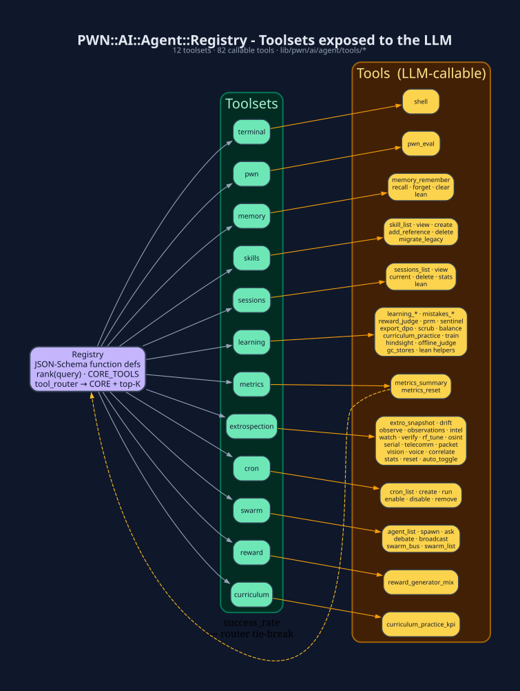

# Agent Tool Registry

`PWN::AI::Agent::Registry` (`lib/pwn/ai/agent/registry.rb`) collects every
LLM-callable function into named **toolsets**. A persona is granted a subset of
toolsets; the JSON-Schema for each tool is what the model actually sees.



## Toolsets to tools  (13 toolsets · 85 tools)

| Toolset | Tools | Backed by |
|---|---|---|
| `terminal` | `shell` | `Open3.capture3` on the host, after `PWN::AI::Agent::ToolGuard` |
| `pwn` | `pwn_eval` | `TOPLEVEL_BINDING.eval` in the live REPL process, after `ToolGuard` |
| `memory` | `memory_remember` · `memory_recall` · `memory_forget` · `memory_clear` · **`memory_lean`** | `PWN::Memory` → `~/.pwn/memory.json` |
| `skills` | `skill_list` · `skill_view` · `skill_create` · `skill_add_reference` · `skill_delete` · `skill_migrate_legacy` | `~/.pwn/skills/<name>/SKILL.md` (**[agentskills.io](https://agentskills.io) spec**; legacy flat `*.md` auto-migrated) |
| `sessions` | `sessions_list` · `sessions_view` · `sessions_current` · `sessions_delete` · `sessions_stats` · **`sessions_lean`** | `PWN::Sessions` → `~/.pwn/sessions/` |
| `learning` | `learning_note_outcome` · `learning_reflect` · `learning_distill_skill` · `learning_stats` · `learning_outcomes` · `learning_consolidate` · `learning_reset` · `learning_auto_introspect_toggle` · **`learning_gc_stores`** · **`learning_purge_noise`** · **`mistakes_list`** · **`mistakes_record`** · **`mistakes_resolve`** · **`mistakes_reset`** · **`mistakes_lean`** · **`reward_judge`** · **`reward_prm`** · **`reward_sentinel`** · **`reward_preferences`** · **`reward_export_dpo`** · **`reward_warm_sentinel`** · **`reward_scrub_preferences`** · **`reward_preference_balance`** · **`curriculum_practice`** · **`curriculum_train`** · **`curriculum_hindsight`** · **`curriculum_offline_judge`** · **`curriculum_preference_balance`** | `PWN::AI::Agent::Learning` + `Mistakes` + `Reward` + `Curriculum` → `~/.pwn/learning.jsonl` + `~/.pwn/mistakes.json` + `~/.pwn/preferences.jsonl` + `~/.pwn/curriculum/` + `~/.pwn/finetune/` |
| `reward` | **`reward_generator_mix`** | `PWN::AI::Agent::Reward.generator_mix` → online preference source-mix controller (`preferences.jsonl`) |
| `curriculum` | **`curriculum_practice_kpi`** | `PWN::AI::Agent::Curriculum.practice_kpi` → `~/.pwn/curriculum_kpi.jsonl` |
| `metrics` | `metrics_summary` · `metrics_reset` | `PWN::AI::Agent::Metrics` → `~/.pwn/metrics.json` |
| `policy` | **`policy_stats`** · **`policy_evaluate`** · **`policy_recommend`** | `PWN::AI::Agent::Policy` → `~/.pwn/policy.json` + `~/.pwn/policy_traj.jsonl` |
| `extrospection` | `extro_snapshot` · `extro_drift` · `extro_observe` · `extro_observations` · `extro_intel` · **`extro_watch`** · **`extro_verify`** · **`extro_rf_tune`** · **`extro_osint`** · **`extro_serial`** · **`extro_telecomm`** · **`extro_packet`** · **`extro_vision`** · **`extro_voice`** · `extro_correlate` · `extro_stats` · `extro_reset` · `extro_auto_toggle` | `PWN::AI::Agent::Extrospection` (+ Serial/Packet/OCR/Voice/BareSIP/TransparentBrowser/GQRX) → `~/.pwn/extrospection.json` |
| `cron` | `cron_list` · `cron_create` · `cron_run` · `cron_enable` · `cron_disable` · `cron_remove` | `PWN::Cron` → `~/.pwn/cron/jobs.yml` |
| `swarm` | `agent_list` · `agent_spawn` · `agent_ask` · `agent_debate` · `agent_broadcast` · `swarm_bus` · `swarm_list` | `PWN::AI::Agent::Swarm` → `~/.pwn/agents.yml` + `~/.pwn/swarm/` |

The `learning` toolset is deliberately large: **Mistakes** (negative feedback),
**Reward** (outcome and process judges, sentinel, preference ledger) and
**Curriculum** (self-play, hindsight relabel, optional LoRA gate) are facets of
the same self-improvement loop - see [Reinforcement Learning](Reinforcement-Learning.md).
The thin `reward` and `curriculum` toolsets expose controller and KPI surfaces
(`reward_generator_mix`, `curriculum_practice_kpi`) so personas can grant just
those without the full learning surface.
`shell` and `pwn_eval` share `PWN::AI::Agent::ToolGuard`
(`lib/pwn/ai/agent/tool_guard.rb`) before they run. The guard remaps common
wrong keys, rejects ellipsis placeholders, refuses bash-only syntax unless
`ai.agent.shell_bash` is true (default runner is `/bin/sh`), and blocks live
host-discovery unless the request is in-scope or `ai.agent.recon_authorized`
is true.

The `policy` toolset is inspect-only. `policy_stats`, `policy_evaluate`, and
`policy_recommend` read the live Q / REINFORCE table. Reset is Ruby-only, so a
tool call cannot wipe the weights. `Registry.rank` may add a small Q-advantage
after a pair has been visited at least twice. Planning still owns the work.

**Store hygiene tools** (`memory_lean`, `sessions_lean`, `mistakes_lean`,
`learning_gc_stores`) trim ephemeral or oversized state without dropping
protected operator preferences, open mistakes, or gold outcomes.

## Dynamic tool-set slimming (`ai.agent.tool_router`)

Shipping every schema on every turn overwhelms a small local model - the
choice space is huge and it mis-routes (for example, picks an RF tool for a git
question). When `ai.agent.tool_router: true` **and** `Loop.run` passes the
user request through as `relevance:`, `Registry.definitions` shrinks the
pool to:

```text
CORE_TOOLS  = shell · pwn_eval · memory_remember · memory_recall
              mistakes_record · mistakes_resolve · learning_note_outcome
            + top-K keyword-ranked matches for THIS request
              (ties break on Metrics per-engine success_rate, then
               ai.agent.tool_preference)
```

```ruby
PWN::AI::Agent::Registry.definitions(relevance: 'nmap sweep 10.0.0.0/8', top_k: 10)
PWN::AI::Agent::Registry.rank(query: 'run a shell command')   # inspect ranking
PWN::AI::Agent::Registry.preference_order                     # Env / DEFAULT_PREFERENCE
PWN::AI::Agent::Registry.toolsets                              # -> the 13 names above
PWN::AI::Agent::Registry.all.count                             # -> 85
```

Frontier engines leave `tool_router` off (unless you set it) and receive the
full set. Local engines (`ollama` / `openwebui`) default `tool_router` to on.

## Tool preference (`ai.agent.tool_preference`)

When keyword fit and other rank scores tie, the registry prefers this
default order:

```text
memory_recall · pwn_eval · shell
mistakes_record · mistakes_resolve · learning_note_outcome · memory_remember
```

Set `ai.agent.tool_preference` in `~/.pwn/pwn.yaml`, or pass `order:` /
`preference:` into `Registry.definitions`, `.rank`, or `.apply_preference`.
An explicit empty list turns preference off (no Env / default fallback).

Keyword fit stays the primary signal. Preference is a smaller bonus plus a
stable sort after the router slims the pool, so `memory_recall` wins a
tie against `shell` without hiding a better keyword match.

`Policy` uses the same list when it suggests a next action in the prompt.

## Adding a tool

```ruby
# lib/pwn/ai/agent/tools/my_thing.rb
PWN::AI::Agent::Registry.register(
  name: 'my_thing_do',
  toolset: 'my_thing',
  description: 'One-line summary the LLM will read.',
  parameters: {
    type: 'object',
    properties: { target: { type: 'string' } },
    required: ['target']
  }
) do |args|
  PWN::Plugins::MyThing.do(target: args['target'])
end
```

Drop the file in `lib/pwn/ai/agent/tools/`. It is auto-loaded on next launch.

## Restricting a persona

```yaml
# ~/.pwn/agents.yml
recon:
  role: "Passive OSINT only. Never touch the target directly."
  toolsets: [terminal, pwn, memory, extrospection]   # no swarm, no cron
  engine: ollama
```

**See also:** [pwn-ai Agent](pwn-ai-Agent.md) · [Mistakes](Mistakes.md) ·
[Reinforcement Learning](Reinforcement-Learning.md) · [Swarm](Swarm.md)

[← Home](Home.md)
