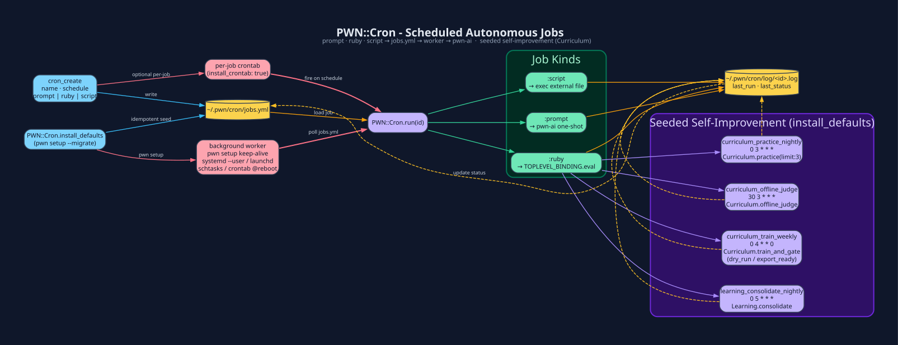

# Cron - Scheduled Autonomous Jobs

`PWN::Cron` (`lib/pwn/cron.rb`) stores job definitions in
`~/.pwn/cron/jobs.yml`. `pwn setup` starts (or reuses) a background cron
worker and installs an OS-native keep-alive so YAML jobs fire on schedule
without a per-job crontab line:

- Linux: `systemd --user` (Restart=always), else `crontab @reboot`
- macOS: `launchd`
- Windows: `schtasks`
- otherwise: `crontab @reboot` when `crontab(1)` exists

You can still pass `install_crontab: true` on `cron_create` to add a
per-job system line. `PWN::Cron.install_worker_crontab` is idempotent and
does not remove existing per-job lines.



## Job kinds

| Kind | Executed as | Use for |
|---|---|---|
| `prompt:` | `pwn --ai "<prompt>"` one-shot | "Re-scan scope nightly and diff findings" |
| `ruby:` | `TOPLEVEL_BINDING.eval` in-process | Direct `PWN::Plugins` calls |
| `script:` | `exec` external file | Anything not in Ruby |

## Tools

| Tool | Purpose |
|---|---|
| `cron_create(schedule:, prompt:/ruby:/script:, install_crontab:)` | Define a job |
| `cron_list` | id · name · schedule · enabled · last_run · last_status |
| `cron_run(id:)` | Fire immediately (updates last_run/last_status) |
| `cron_enable` / `cron_disable` | Toggle without deleting |
| `cron_remove` | Delete from `jobs.yml` (does **not** scrub crontab - `crontab -e` yourself) |

## Seeded self-improvement jobs (`PWN::Cron.install_defaults`)

`pwn setup --migrate` (schema `v1`) seeds five jobs into every fresh
`~/.pwn/cron/jobs.yml` via `PWN::Cron.install_defaults`:

| Name | Schedule | Enabled | Ruby |
|---|---|---|---|
| `curriculum_practice_nightly` | `0 3 * * *` | **no** | `Curriculum.practice(limit: 3)` - opt-in; runs `Loop.run` with real tools |
| `curriculum_offline_judge` | `30 3 * * *` | **no** | `Curriculum.offline_judge(...)` - opt-in; spends API tokens |
| `curriculum_train_weekly` | `0 4 * * 0` | **no** | `Curriculum.train_and_gate(dry_run: true)` - opt-in; needs trainer+GPU to actually train |
| `learning_consolidate_nightly` | `0 5 * * *` | **yes** | `Learning.consolidate` - memory GC |
| `pwn_stores_lean_nightly` | `15 5 * * *` | **yes** | `Learning.gc_stores!` - lean memory, learning.jsonl, mistakes, policy, sessions |

- **practice / judge / train** ship **disabled**. Practice self-plays via `Loop.run` (shell, browsers). Judge hits the live model. Train is a no-op without a LoRA trainer. Enable with `cron_enable` when you want that loop.
- **consolidate + lean** stay on: they only touch `~/.pwn` files so the injected MEMORY / LEARNING / session tail stays high-signal.

- **practice** - top unresolved `Mistakes` under `Reward.judge`; auto-`resolve` with ≥2 holdouts
- **offline_judge** - backfill outcome/process labels + plan calibration from PLAN `p(success)=` so `:failure_only` local introspect does not starve the corpus; also runs `Reward.warm_sentinel` so the reward-sentinel window can fill on local hosts
- **dedupe** - legacy alias `offline_judge_nightly` counts as the same job; `install_defaults` will not double-seed `30 3 * * *` and disables the alias when both exist
- **train** - export SFT + balanced DPO, LoRA-train `pwn-vN+1`, replay Mistakes.top, promote only on win. `dry_run: false` only with a trainer+GPU
- **consolidate** - memory GC (semantic merge + importance eviction) so the injected MEMORY block stays high-signal

See [Reinforcement Learning](Reinforcement-Learning.md).

`cron_disable(id:)` turns either off; `install_defaults` is idempotent (including legacy alias collapse) and
never overwrites a job you already have with the same name.

## Example

```ruby
cron_create(
  name: 'nightly_scope_sweep',
  schedule: '0 2 * * *',
  prompt: 'extro_snapshot, then NmapIt sweep 10.0.0.0/24, extro_observe every '\
          'new open port, extro_correlate, and post a one-paragraph summary.',
  install_crontab: true
)
```

At 02:00 the system cron fires `PWN::Cron.run`, which spins up a headless
`pwn-ai` turn. With `auto_introspect` on (and optional `auto_extrospect` for
the cheap `AUTO_SECTIONS` baseline), the run updates Learning/Metrics - and,
if enabled, host/repo/env posture - so tomorrow's interactive session already
knows what changed overnight. Sense tools (`intel`/`verify`/`watch`) stay
on-demand; cron is not expected to launch Burp/ZAP/msf/GQRX.

```ruby
cron_create(
  name: 'memory_revalidate',
  schedule: '0 4 * * 0',
  ruby: 'PWN::AI::Agent::Extrospection.revalidate_memory'
)
```

Weekly, headless-browser fact-check of every `PWN::Memory` `:fact` containing
a CVE / version string / URL. Refuted entries get prefixed `[UNVERIFIED
yyyy-mm-dd]` so the injected MEMORY block stops calcifying into
confidently-wrong priors - see [Extrospection § revalidate_memory](Extrospection.md).

**See also:** [Sessions](Sessions.md) · [Extrospection](Extrospection.md) ·
[Reinforcement Learning](Reinforcement-Learning.md) · [CLI Drivers](CLI-Drivers.md)

[← Home](Home.md)
