# PWN Data-Flow Diagrams

27 SVG diagrams, all rendered from Graphviz sources in
[`diagrams/dot/`](diagrams/dot/) with a single shared visual theme
(see [`_THEME.md`](diagrams/dot/_THEME.md)). Rebuild everything with:

```bash
cd documentation/diagrams && ./build.sh
```

Every diagram uses strict layer→layer edges (`newrank=true` + `{rank=same}`
groups) so lines never criss-cross.

---

## 1 · Architecture

### Overall PWN Architecture
[source](diagrams/dot/overall-pwn-architecture.dot) · doc: [How PWN Works](How-PWN-Works.md)


### `~/.pwn/` Persistence Map
[source](diagrams/dot/persistence-filesystem.dot) · doc: [Persistence](Persistence.md)
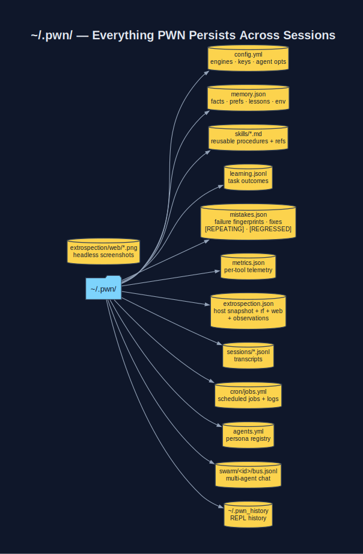

### Plugin Ecosystem (66 modules)
[source](diagrams/dot/plugin-ecosystem.dot) · doc: [Plugins](Plugins.md)


---

## 2 · Entry Points

### `pwn` REPL Prototyping
[source](diagrams/dot/pwn-repl-prototyping.dot) · doc: [pwn REPL](pwn-REPL.md)


### REPL History → Reusable Driver / Skill
[source](diagrams/dot/history-to-drivers.dot) · doc: [Drivers](Drivers.md)


### Driver Anatomy (`bin/pwn_*`)
[source](diagrams/dot/driver-framework.dot) · doc: [CLI Drivers](CLI-Drivers.md)
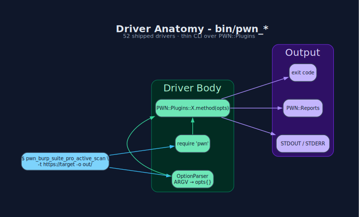

---

## 3 · AI Agent

### pwn-ai Closed Self-Improvement Loop
[source](diagrams/dot/pwn-ai-feedback-learning-loop.dot) · doc: [Skills, Memory & Learning](Skills-Memory-Learning.md)


### Mistakes — Negative-Feedback Loop
[source](diagrams/dot/mistakes-negative-feedback.dot) · doc: [Mistakes](Mistakes.md)
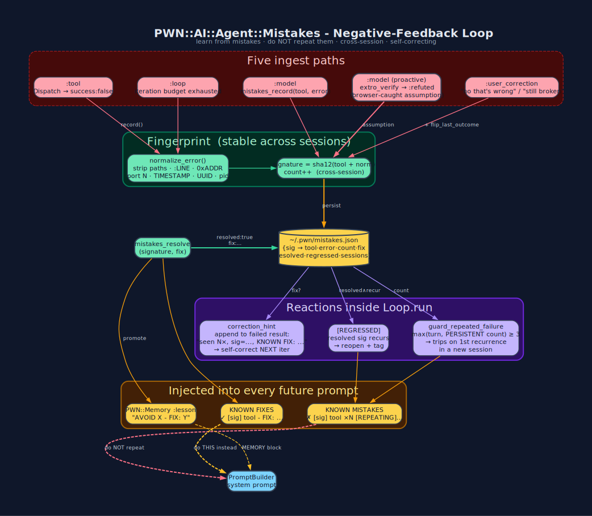

### Multi-Provider LLM Integration
[source](diagrams/dot/ai-integration-tool-calling.dot) · doc: [AI Integration](AI-Integration.md)
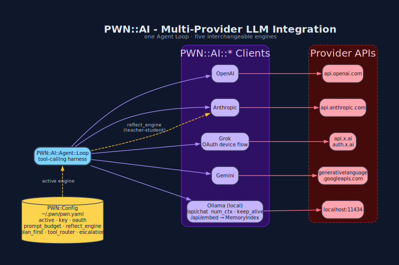

### Agent Tool Registry (10 toolsets · 54 tools)
[source](diagrams/dot/agent-tool-registry.dot) · doc: [Agent Tool Registry](Agent-Tool-Registry.md)


### Memory · Skills · Sessions Detail
[source](diagrams/dot/memory-skills-detailed.dot) · doc: [Skills, Memory & Learning](Skills-Memory-Learning.md)


### Extrospection — World Awareness
[source](diagrams/dot/extrospection-world-awareness.dot) · doc: [Extrospection](Extrospection.md)
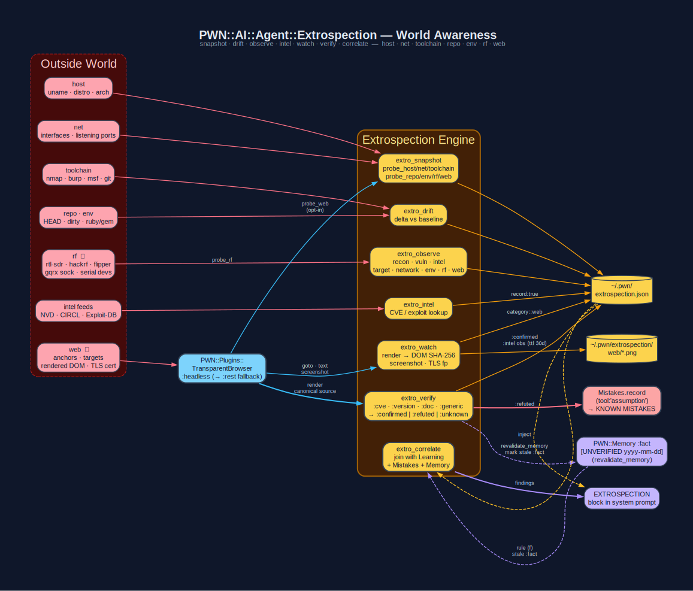

### Swarm — Native Multi-Agent
[source](diagrams/dot/swarm-multi-agent.dot) · doc: [Swarm](Swarm.md)
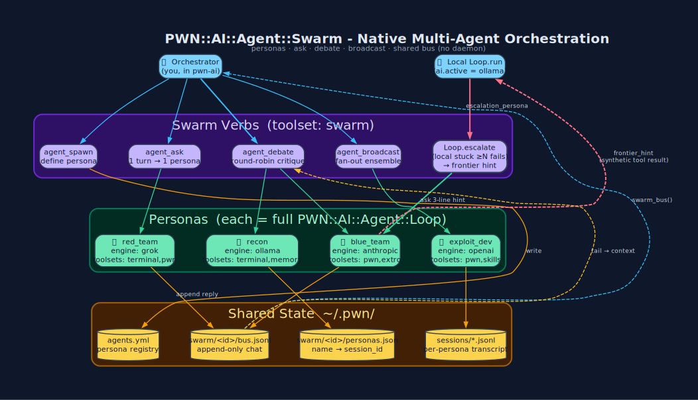

### Cron — Scheduled Jobs
[source](diagrams/dot/cron-scheduling.dot) · doc: [Cron](Cron.md)
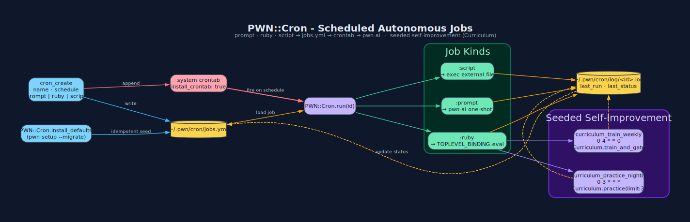

### Sessions ↔ Cron ↔ Swarm Continuity
[source](diagrams/dot/sessions-cron-automation.dot) · doc: [Sessions](Sessions.md)
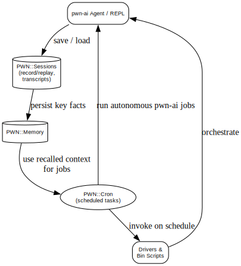

---

## 4 · Security Workflows

### End-to-End Penetration Test
[source](diagrams/dot/penetration-testing-workflow.dot)


### Web Application Testing
[source](diagrams/dot/web-application-testing.dot) · doc: [BurpSuite](BurpSuite.md)


### Burp ⭐ vs ZAP Selection
[source](diagrams/dot/burp-vs-zap-preference.dot)
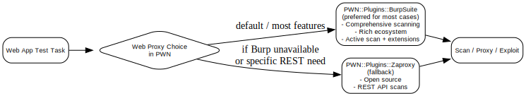

### Network & Infrastructure Testing
[source](diagrams/dot/network-infra-testing.dot) · doc: [NmapIt](NmapIt.md)


### SAST / Code Scanning
[source](diagrams/dot/code-scanning-sast.dot) · doc: [SAST](SAST.md)


### Fuzzing
[source](diagrams/dot/fuzzing-workflow.dot) · doc: [Fuzzing](Fuzzing.md)


### Reverse Engineering & Binary Exploitation
[source](diagrams/dot/reverse-engineering-flow.dot) · doc: [Hardware](Hardware.md)


### Zero-Day Research Lifecycle
[source](diagrams/dot/zero-day-research-flow.dot)
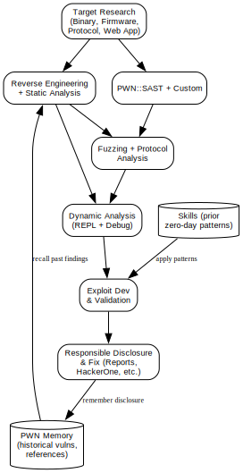

### Reporting Pipeline
[source](diagrams/dot/reporting-pipeline.dot) · doc: [Reporting](Reporting.md)
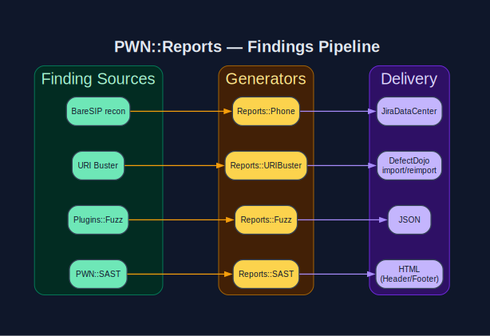

---

## 5 · Domain-Specific

### AWS Cloud Security (90 services)
[source](diagrams/dot/aws-cloud-security.dot) · doc: [AWS](AWS.md)
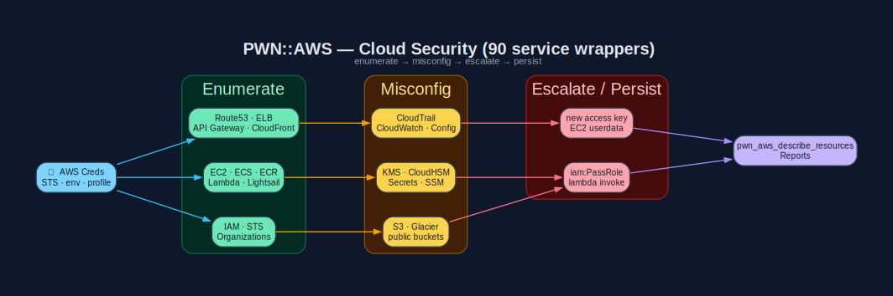

### SDR / Radio Hacking
[source](diagrams/dot/sdr-radio-flow.dot) · doc: [SDR](SDR.md)
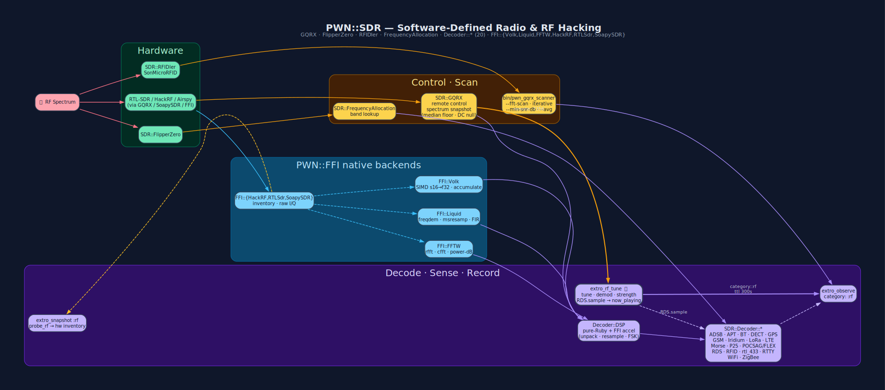

### Hardware & Physical-Layer
[source](diagrams/dot/hardware-hacking.dot) · doc: [Hardware](Hardware.md)
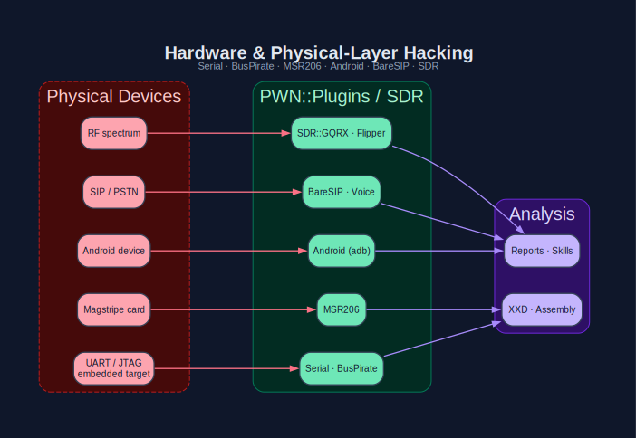

---

[← Back to Home](Home.md)
