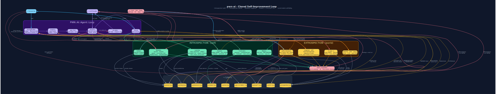
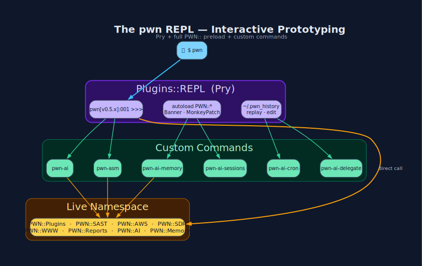
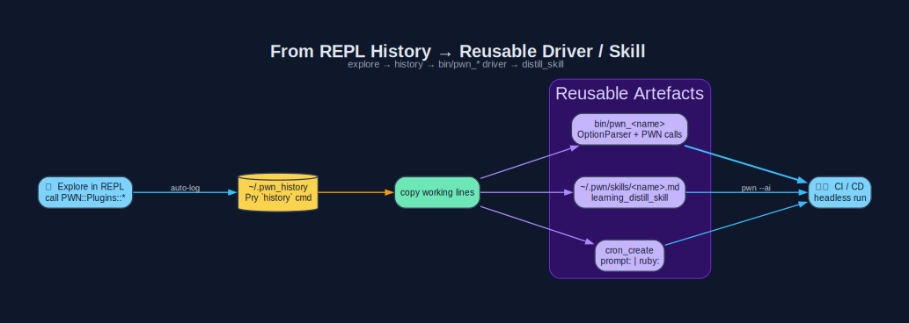
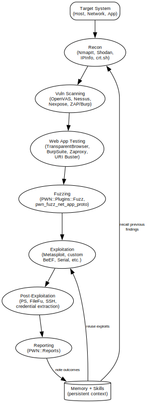
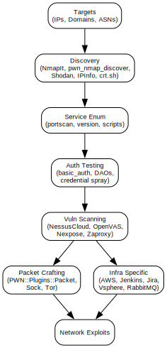
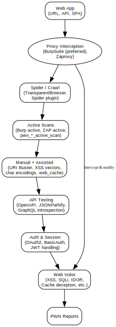
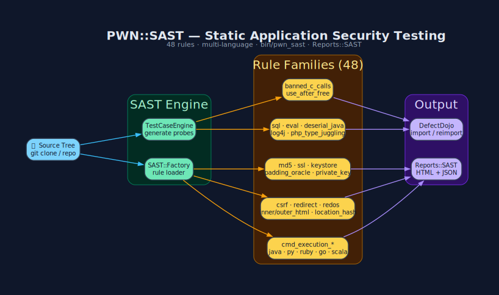
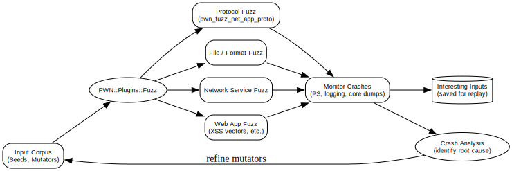
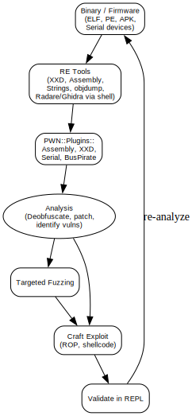

# PWN Data Flow Diagrams (DFDs)

This page provides visual SVG Data Flow Diagrams illustrating how the PWN offensive cybersecurity framework operates across its key components and workflows.

## Core Architecture & Learning

- **PWN-AI Feedback Learning Loop**: The closed-loop self-improvement system using Memory, Skills, Metrics, and Learning to evolve capabilities.
  

- **PWN REPL Prototyping**: Interactive development and rapid prototyping inside the full PWN namespace.
  

- **History Command to Driver Generation**: How REPL exploration and `history` are turned into reusable Drivers and Skills.
  

## Primary Security Workflows

- **Penetration Testing Workflow**: End-to-end red teaming from recon to reporting, leveraging all PWN capabilities.
  

- **Network & Infrastructure Testing**: Discovery, enumeration, scanning, packet crafting, and infra-specific testing (AWS, Jenkins, etc.).
  

- **Web Application Testing**: Proxy-driven spidering, active scanning, manual assisted testing, and API security assessment. (BurpSuite preferred)
  

- **Code Scanning & SAST**: Static analysis, test case generation, and vulnerability reporting using `PWN::SAST`.
  

- **Fuzzing Workflows**: Protocol, file, network, and web fuzzing with monitoring and corpus refinement.
  

- **Reverse Engineering Flow**: Binary/firmware analysis, patching, targeted fuzzing, and exploit crafting.
  

## Additional Notes

- Diagrams are generated using Graphviz (dot) from source `.dot` files in `diagrams/dot/`.
- These visualize the integration of:
  - `PWN::Plugins` (67+ modules)
  - `PWN::AI::Agent` + tool calling + LLM providers
  - `PWN::Memory`, `PWN::Skills`, and Learning loop
  - `PWN::SAST`, `PWN::Reports`, `PWN::Driver`
- For the source definitions, see `diagrams/dot/*.dot`.
- Update these diagrams by editing the `.dot` files and re-rendering with `dot -Tsvg`.

## Related Wiki Pages

- [How PWN Works](How-PWN-Works.md)
- [pwn-ai Agent](pwn-ai-Agent.md)
- [pwn REPL](pwn-REPL.md)
- [Skills, Memory & Learning](Skills-Memory-Learning.md)
- [Plugins](Plugins.md)
- [SAST](SAST.md)
- [Drivers](Drivers.md)

[[Diagrams]]
