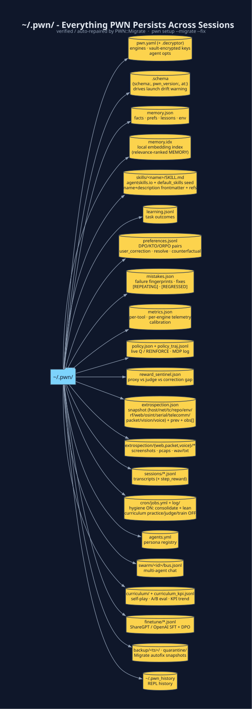

# `~/.pwn/` - Persistence Map

Every byte PWN remembers between processes lives here.



| Path | Owner | Format | Reset tool | Purpose |
|---|---|---|---|---|
| `pwn.yaml` | `PWN::Config` · `PWN::Plugins::Vault` | AES-encrypted YAML | `pwn-vault` | engines, keys, agent options |
| `pwn.yaml.decryptor` | `PWN::Plugins::Vault` | key/IV | - | decrypts `pwn.yaml` (or set `PWN_DECRYPTOR_KEY`/`_IV`) |
| **`.schema`** | **`PWN::Migrate`** | JSON `{schema:,pwn_version:,at:}` | `pwn setup --migrate` | **schema stamp - drives the one-line drift warning on launch** |
| `memory.json` | `PWN::Memory` | JSON array | `memory_clear` | facts · prefs · lessons · env - injected into every prompt |
| `memory.idx` | `PWN::MemoryIndex` | JSON `{key → {sha,vec}}` | `PWN::MemoryIndex.reset` | local embedding index over `memory.json` - powers **relevance-ranked** MEMORY injection (incremental; only re-embeds changed entries) |
| `skills/<name>/SKILL.md` | `PWN::Config.load_skills` | **[agentskills.io](https://agentskills.io) spec** - `name`+`description` YAML front-matter | `skill_delete` | reusable procedures + `metadata.references:`. Fresh install seeds bundled skills from `etc/default_skills/` via `PWN::Config.install_default_skills` (never overwrites an existing file). Legacy flat `skills/*.md` auto-migrated by `skill_migrate_legacy` / `pwn setup --migrate --fix`. |
| `learning.jsonl` | `PWN::AI::Agent::Learning` | JSON-per-line | `learning_reset` | task outcome log → success_rate |
| **`preferences.jsonl`** | **`PWN::AI::Agent::Reward`** | JSON-per-line `{prompt,rejected,chosen,source}` | `rm` | **DPO/KTO/ORPO preference-pair ledger - user_correction · mistakes_resolve · counterfactual · critic · curriculum** |
| **`mistakes.json`** | **`PWN::AI::Agent::Mistakes`** | **JSON `{sig → entry}`** | **`mistakes_reset`** | **failure fingerprints · cross-session count · fix · `[REPEATING]` · `[REGRESSED]`** |
| `metrics.json` | `PWN::AI::Agent::Metrics` | JSON | `metrics_reset` | per-tool calls · success · avg_duration · last_error · **per-engine** sub-buckets · calibration |
| **`policy.json`** | **`PWN::AI::Agent::Policy`** | JSON `{q,h,visits,returns}` | `PWN::AI::Agent::Policy.reset` | Live Q table + REINFORCE logits. Advisory rank only. |
| **`policy_traj.jsonl`** | **`PWN::AI::Agent::Policy`** | JSON-per-line episodes | `PWN::AI::Agent::Policy.reset` | MDP trajectories `(s,a,r,s')` from each Loop turn |
| `reward_sentinel.json` | `PWN::AI::Agent::Reward` | JSON | `rm` | proxy vs judge vs user-correction gap history |
| `extrospection.json` | `PWN::AI::Agent::Extrospection` | JSON | `extro_reset` | host/net/toolchain/repo/env/**rf**/**web**/osint/serial/telecomm/packet/vision/voice snapshot + previous baseline + observations[] |
| `extrospection/web/*.png` | `Extrospection` | PNG | `rm -rf` | headless-browser screenshots from `probe_web` / `extro_watch` (opt-in) |
| `extrospection/packet/*.pcap` | `Extrospection` | pcap | `rm -rf` | bounded captures from `extro_packet(action: :capture)` |
| `extrospection/voice/*` | `Extrospection` | wav / txt | `rm -rf` | TTS/STT artifacts from `extro_voice` |
| `sessions/*.jsonl` | `PWN::Sessions` | JSON-per-line | `sessions_delete` | full transcript per pwn-ai run (with per-step `step_reward` from `Reward.prm`) |
| `open_goal.json` | `PWN::AI::Agent::OpenGoal` | JSON | delete the file | unfinished host-work request so `continue` / `resume` picks it up |
| `cron/jobs.yml` | `PWN::Cron` | YAML | `cron_remove` | scheduled jobs. Fresh install seeds hygiene (`learning_consolidate_nightly` + `pwn_stores_lean_nightly` **on**) and curriculum practice/judge/train **off** |
| `cron/log/*.log` | `PWN::Cron` | text | rm | last_run output |
| `agents.yml` | `PWN::AI::Agent::Swarm` | YAML | edit / `agent_spawn` | persona registry |
| `swarm/<id>/bus.jsonl` | `Swarm` | JSON-per-line | rm -rf | append-only multi-agent chat |
| `swarm/<id>/personas.json` | `Swarm` | JSON | rm | persona → session_id map |
| `curriculum/` | `PWN::AI::Agent::Curriculum` | JSONL | rm -rf | self-play reproducers · train/gate A/B eval sets |
| `curriculum_kpi.jsonl` | `PWN::AI::Agent::Curriculum.practice_kpi` | JSONL | rm | outer curriculum KPI snapshots (repeating-mistake trend) |
| `finetune/*.jsonl` | `Learning.export_finetune` · `Reward.export_dpo` | ShareGPT / OpenAI / DPO JSONL | `rm` | supervised + preference datasets - feed to a LoRA over the local model |
| `backup/<ts>/` | `PWN::Migrate` | tree copy | rm -rf | timestamped snapshot taken before every `--migrate --fix` |
| `quarantine/` | `PWN::Migrate` | quarantined originals | rm -rf | corrupt/incompatible state files moved aside so the owner re-seeds |
| `~/.pwn_history` | Pry | text | rm | REPL input history |


## `memory.json` safety

`PWN::Memory.save` **refuses** to overwrite a non-empty `memory.json` with `{}`
unless you pass `force: true`. That blocks the failure mode where a parse error
was rescued into an empty hash and then written back (full wipe). `memory_clear`
and deleting the last key use `force: true` on purpose. Load no longer falls
back to `{}` on parse failure for a non-empty file; it warns and keeps the bytes
on disk for repair.

## Verify / repair the whole tree

```bash
pwn setup --migrate            # per-file compatibility report + apply schema migrations
pwn setup --migrate --fix      # + autofix (backup → quarantine/repair → vault backfill)
```

```ruby
PWN::Migrate.status            # machine-readable rows
PWN::Migrate.needed?           # ~/.pwn/.schema older than PWN::Migrate::SCHEMA_VERSION ?
```

See [Installation § Upgrading](Installation.md#upgrading--pwn-state-migration-pwnmigrate)
for the full `PWN::Migrate` API.

## Back it up

```bash
tar czf pwn-state-$(date +%F).tgz -C "$HOME" .pwn
```

`pwn setup --migrate --fix` also writes one automatically to
`~/.pwn/backup/<timestamp>/` before touching anything.

## Start fresh for a new engagement

```ruby
# inside pwn-ai - keeps config & skills, wipes engagement-specific state
extro_reset(confirm: true)     # host snapshot + observations
mistakes_reset(confirm: true)  # failure fingerprints (host-specific errors)
learning_reset(confirm: true)  # task outcomes (optional)
metrics_reset(confirm: true)   # tool telemetry (optional)
PWN::AI::Agent::Policy.reset   # live Q table + trajectory log (optional)
```

[← Home](Home.md) · [Configuration](Configuration.md) · [Installation](Installation.md)

## Store hygiene (lean / GC)

Keep `~/.pwn` small without dropping gold learning outcomes, open mistakes, or
protected operator preferences:

| Tool | What it trims |
|---|---|
| `memory_lean` | expired `session_*` keys and overlong values (`VALUE_MAX_CHARS`) |
| `sessions_lean` | stub/aged transcripts not pinned by gold outcomes or open mistakes |
| `mistakes_lean` | compact fields; age out resolved-once signatures whose fix already lives in Memory |
| `learning_gc_stores` | coordinated lean pass across memory, learning, mistakes, sessions, and Policy trajectories |

All four support `dry_run: true` (plan only). Protected `operator_pref_*`,
`process_sop_*`, and `mistake_fix_*` memory keys are never removed by lean.

