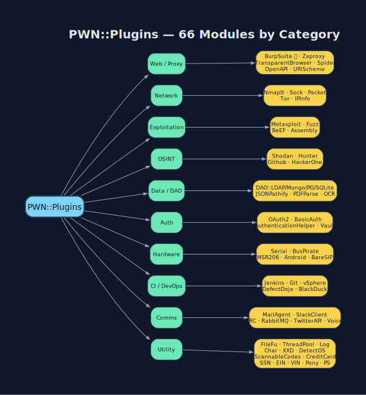

# `PWN::Plugins` - All 66 Modules

Every plugin is a plain Ruby module of `public_class_method def self.x(opts = {})`
methods with self-documenting `.help`. Source: `lib/pwn/plugins/*.rb`.



## Discover in the REPL

```ruby
PWN::Plugins.constants.sort
PWN::Plugins::BurpSuite.help
ls PWN::Plugins::NmapIt
show-source PWN::Plugins::Fuzz.generate
```

## By category

### Web / Proxy / Browser
| Module | Purpose | Doc |
|---|---|---|
| **`BurpSuite`** ⭐ | Headless + REST control of Burp Pro; active/passive scan | [BurpSuite](BurpSuite.md) |
| `Zaproxy` | OWASP ZAP (fallback) | - |
| **`TransparentBrowser`** | Watir/Chrome headless or visible; devtools; proxy-aware | [Transparent-Browser](Transparent-Browser.md) |
| `Spider` | Recursive crawler | - |
| `OpenAPI` | Swagger/OpenAPI parse + fuzz targets | - |
| `URIScheme` | URI helpers | - |

### Network
| Module | Purpose | Doc |
|---|---|---|
| **`NmapIt`** | Nmap wrapper + XML parse | [NmapIt](NmapIt.md) |
| `Sock` | Raw TCP/UDP client; banner grab | - |
| `Packet` | Craft/sniff L2/L3 (PacketFu) | - |
| `Tor` | Start/rotate Tor for egress | - |
| `IPInfo` | Geo/ASN lookup | - |

### Exploitation
| Module | Purpose | Doc |
|---|---|---|
| **`Metasploit`** | msfrpcd client; run modules; sessions | [Metasploit](Metasploit.md) |
| **`Fuzz`** | Mutation/generation fuzzer | [Fuzzing](Fuzzing.md) |
| `BeEF` | Browser Exploitation Framework hooks | - |
| `Assembly` | asm ↔ opcodes (multi-arch, keystone/capstone) | - |

### OSINT / Recon
| Module | Purpose |
|---|---|
| `Shodan` | host/search/GraphQL introspection |
| `Hunter` | email discovery |
| `Github` | code/secret search |
| `HackerOne` | program/report API |

### Data Access / Parsing
| Module | Purpose |
|---|---|
| `DAOLDAP` · `DAOMongo` · `DAOPostgres` · `DAOSQLite3` | DB clients |
| `JSONPathify` | JSONPath query |
| `PDFParse` · `OCR` | document extraction |
| `ScannableCodes` | QR/barcode gen/read |

### Auth / Secrets
| Module | Purpose |
|---|---|
| `OAuth2` · `BasicAuth` · `AuthenticationHelper` | credential flows |
| `Vault` | HashiCorp Vault |

### Hardware / Physical
| Module | Purpose | Doc |
|---|---|---|
| `Serial` · `BusPirate` | UART/SPI/I²C | [Hardware](Hardware.md) |
| `MSR206` | magstripe reader/writer | [Hardware](Hardware.md) |
| `Android` | adb push/pull/shell/screencap | [Hardware](Hardware.md) |
| `BareSIP` · `Voice` | VoIP war-dialing / TTS | [Hardware](Hardware.md) |

### CI / DevOps / Vuln-Mgmt
| Module | Purpose |
|---|---|
| `Jenkins` | jobs/views/plugins/users |
| `Git` | repo helpers |
| `vSphere` | VMware inventory |
| `DefectDojo` | import/reimport findings |
| `BlackDuckBinaryAnalysis` | SBOM + CVE match |
| `NessusCloud` · `NexposeVulnScan` · `OpenVAS` | commercial/OSS scanners |
| `JiraDataCenter` | ticket findings |

### Comms
| Module | Purpose |
|---|---|
| `MailAgent` · `Pony` | SMTP send |
| `SlackClient` · `IRC` · `TwitterAPI` | chat/notify |
| `RabbitMQ` | AMQP |

### Utility
`FileFu` · `ThreadPool` · `Log` · `PWNLogger` · `Char` · `XXD` · `DetectOS` ·
`CreditCard` · `SSN` · `EIN` · `VIN` · `PS` · `MonkeyPatch` · `REPL`

## Full alphabetical list

`Android Assembly AuthenticationHelper BareSIP BasicAuth BeEF
BlackDuckBinaryAnalysis BurpSuite BusPirate Char CreditCard DAOLDAP DAOMongo
DAOPostgres DAOSQLite3 DefectDojo DetectOS EIN FileFu Fuzz Git Github
HackerOne Hunter IPInfo IRC Jenkins JiraDataCenter JSONPathify Log MailAgent
Metasploit MonkeyPatch MSR206 NessusCloud NexposeVulnScan NmapIt OAuth2 OCR
OpenAPI OpenVAS Packet PDFParse Pony PS PWNLogger RabbitMQ REPL ScannableCodes
Serial Shodan SlackClient Sock Spider SSN ThreadPool Tor TransparentBrowser
TwitterAPI URIScheme Vault VIN Voice Vsphere XXD Zaproxy`

[← Home](Home.md) · [Diagrams](Diagrams.md)
