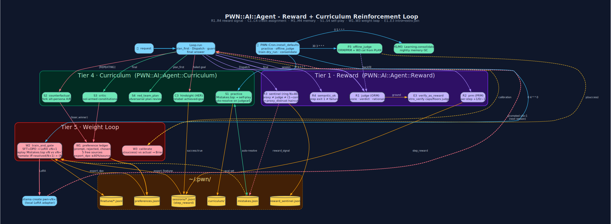

# Reinforcement Learning in pwn-ai

pwn-ai implements a **six-tier** in-context → weight-level RL loop that
implements a six-tier in-context → weight-export RL loop that combines
ORM/PRM, preference ledger, mistake curriculum, env-drift blame, DPO export,
and regression-gated LoRA promotion. On hosts **with a trainer + GPU**, the
full `Curriculum.practice → Reward.export_dpo → Curriculum.train_and_gate`
path closes the weight loop; without a trainer the path is **export-ready**
(datasets + manual CLI) and the live learning is in-context only.



```
                       ┌────────────────────────────────────────────────┐
        request ──────►│ Loop.run                                       │
                       │  plan_first ─► Curriculum.red_team_plan  (S4)  │
                       │  Dispatch ──► Reward.semantic_ok         (R4)  │
                       │            └► Mistakes.record(cause:)    (E1)  │
                       │  guard ────► Curriculum.counterfactual   (S2)  │──► Reward.record_preference (W1)
                       │  final ────► Curriculum.critic           (S3)  │
                       │            └► Reward.judge (ORM)         (R1)  │──► Reward.verify_as_reward   (E3)
                       │            └► Reward.prm   (PRM)         (R2)  │──► Sessions[step_reward]     (C4)
                       │            └► Curriculum.hindsight       (C3)  │
                       │            └► Curriculum.calibrate       (W3)  │──► Metrics.calibration
                       │            └► Reward.sentinel            (R3)  │──► Mistakes(reward_signal)
                       └────────────────────────────────────────────────┘
                                           │
                    Learning.consolidate (M1 semantic-merge, M3 importance-evict)
                    MemoryIndex.recall_semantic (M2 sim × recency × importance)
                    Registry.rank (C1 α·sim + β·advantage + γ·UCB)
                    Learning.exemplars_for (C2 prioritized replay, C4 minimal trace)
                                           │
              nightly cron ──► Curriculum.practice (S1) ──► Mistakes.resolve ──► preference (W1)
              weekly  cron ──► Curriculum.train_and_gate (W2) ──► LoRA vN+1 ──► A/B gate ──► promote
                                           │
                    Extrospection.correlate rule 9 (E2 causal lead-lag)
                    Metrics.changepoints (E1 CUSUM) ──► Mistakes(cause: :env_drift)
```

## Tier 1 — Reward signal (`PWN::AI::Agent::Reward`)

| ID | Method | What it does | Beats |
|----|--------|-------------|-------|
| **R1** | `.judge` | LLM Outcome Reward Model → `{score:0..1, verdict:, rationale:, key_step:}`. Replaces `infer_success` regex. | Reflexion (binary self-eval) |
| **R2** | `.prm` | Process Reward Model — per-tool-step `+1/0/−1` written into `Sessions[:step_reward]`. | Lightman '23 (math only) — first PRM on security tooling |
| **R3** | `.sentinel` | proxy vs judge vs (1 − user_correction_rate); >0.15 gap → `Mistakes.record(tool:'reward_signal')`. | — novel |
| **R4** | `.semantic_ok` | `grep exit 1` ≠ failure. `Loop.record_metrics` records Metrics on `:ok`, Mistakes on `!semantic_ok`. Kills phantom `31f1871b8a15`. | — bugfix |

## Tier 2 — Credit assignment & replay

| ID | Where | What |
|----|-------|------|
| **C1** | `Registry.rank` + `Metrics.{ucb,thompson,advantage}` | score = α·keyword_sim + β·advantage + γ·UCB1. Untried tools get exploration bonus. |
| **C2** | `Learning.exemplars_for` | priority = judge_score × e^(−Δt/30d) × keyword_sim. |
| **C3** | `Curriculum.hindsight` | HER — relabel failed trajectory with achieved-goal as `success:true`. |
| **C4** | `Learning.{compress_exemplar,build_skill_from_session}` | keep only `step_reward > 0` — minimal sufficient trace. |

## Tier 3 — Memory that stays high-signal

| ID | Where | What |
|----|-------|------|
| **M1** | `Learning.consolidate` → `semantic_merge` | embed `:lesson`, greedy cosine ≥0.92, `Reflect.on("merge → 1 imperative")`. |
| **M2** | `MemoryIndex.recall_semantic` | score = 0.6·sim + 0.25·recency + 0.15·importance (Park '23). |
| **M3** | `Memory.remember(source:,confidence:,importance:,ttl:)` | consolidate evicts by `(age/ttl)/(importance×confidence)` — heuristic garbage self-evicts. |
| **M4** | `Learning.note_outcome` | outcomes → `learning.jsonl` ONLY. Memory `:lesson` reserved for reflect/resolve/human. `purge_noise` GCs pre-R1 garbage. |

## Tier 4 — Curriculum & self-play (`PWN::AI::Agent::Curriculum`)

| ID | Method | What |
|----|--------|------|
| **S1** | `.practice` | mine `Mistakes.top` → generate reproducers → self-play → auto-`resolve` on judge≥0.7. |
| **S2** | `.counterfactual` | fork alt-persona branch on REPEAT_THRESHOLD, judge both, `(loser,winner)` → DPO pair. |
| **S3** | `.critic` | tool-armed constitutional critic (can `shell`/`extro_verify` the claim). |
| **S4** | `.red_team_plan` | adversarial plan review grounded in Metrics/Mistakes/extro_drift telemetry. |

## Tier 5 — Close the weight loop

| ID | Where | What |
|----|-------|------|
| **W1** | `Reward.{record_preference,export_dpo}` | 5 free preference sources: user_correction, mistakes_resolve, counterfactual, curriculum, critic. |
| **W2** | `Curriculum.train_and_gate` | SFT+DPO → unsloth/axolotl LoRA → `ollama create pwn-vN+1` → replay `Mistakes.top` on vN vs vN+1 → promote iff `resolved(N+1) > resolved(N)`. **Without a trainer: export-only** (`weight_loop: :export_ready`). |
| **W3** | `Curriculum.calibrate` + `Metrics.{record_calibration,calibration}` | plan_first `p(success)` vs actual → per-engine Brier/overconfidence. |

## Tier 6 — Deepen the intro↔extro join

| ID | Where | What |
|----|-------|------|
| **E1** | `Metrics.changepoints` (CUSUM) + `Loop.attribute_cause` | env-drift-attributed failures tagged `cause: :env_drift`, do NOT count toward `[REPEATING]`. |
| **E2** | `Extrospection.correlate` rule 9 | lead-lag: "nmap started failing 2.1h AFTER toolchain.nmap changed" with confidence. |
| **E3** | `Reward.verify_as_reward` | browser-verified verdict caps/floors judge score. Ground-truth reward without a human. |

## Config (`PWN::Env[:ai][:agent]`)

```yaml
:ai:
  :agent:
    :critic: true            # S3
    :red_team_plan: true     # S4
    :counterfactual: true    # S2
    :hindsight: true         # C3 (default true)
    :verify_as_reward: true  # E3
```

## Cron self-improvement

```ruby
PWN::Cron.create(name: 'self_play',   schedule: '0 3 * * *',
  ruby: 'PWN::AI::Agent::Curriculum.practice(limit: 5)')
PWN::Cron.create(name: 'offline_judge', schedule: '30 3 * * *',
  ruby: 'PWN::AI::Agent::Curriculum.offline_judge(since_hours: 24, limit: 40)')
PWN::Cron.create(name: 'weight_loop', schedule: '0 4 * * 0',
  ruby: 'PWN::AI::Agent::Curriculum.train_and_gate(dry_run: true)')  # false only with trainer+GPU
PWN::Cron.create(name: 'mem_gc',      schedule: '0 5 * * *',
  ruby: 'PWN::AI::Agent::Learning.consolidate')
```

## Tools exposed to the model

`reward_judge` · `reward_prm` · `reward_sentinel` · `reward_preferences` ·
`reward_export_dpo` · `curriculum_practice` · `curriculum_train` ·
`curriculum_hindsight` · `learning_purge_noise`

## Design claims (architecture — weight promotion requires a trainer)

1. **Process reward on real security tool traces** (R2)
2. **Automatic blame attribution** self vs env-drift via CUSUM×correlate (E1+E2)
3. **Reward-hacking self-detection** (R3)
4. **Mistake-driven curriculum with regression-gated LoRA promotion** (S1+W2)
5. **Five naturally-generated DPO sources** with zero human labelling (W1)


## Operational controls (priority fixes)

| ID | Control | What |
|----|---------|------|
| **P1** | `Curriculum.practice` cooldown + natural prompts | Hard-skips `reward_signal` / parked / `needs_code_change`; N-night zero-score cooldown parks thrash; reproducers are natural user tasks, never signature dumps. |
| **P2** | R4 `semantic_ok` + structured resolve | `31f1871b8a15`-class exit≠0 phantoms stay closed via structured holdouts. |
| **P3** | `Curriculum.offline_judge` | Scores last-24h sessions under ORM/PRM so local `:failure_only` introspect does not starve labels. Cron nightly. |
| **P4** | `Reward.proxy_distrust` | When sentinel fires, Metrics.to_context / Registry.rank haircut proxy rates — actionable, not just another Mistakes row. |
| **R3** | `Reward.sentinel` ring buffer | Fixed-N (`SENTINEL_WINDOW=40`) `{judge,proxy}` window replaces decaying `proxy_sum`/`proxy_n`. Means are always ∈[0,1]; `set_proxy_distrust` refuses proxy∉[0,1]; `reset_sentinel` wipes corrupt state without touching prefs. Legacy decay×`to_i` files auto-clear stuck distrust on load. |
| **P5** | `Curriculum.preference_balance` + critic/counterfactual logs | Surfaces W1 monoculture; critic flaws → DPO pairs; counterfactual fires once per signature per turn. |
| **P6** | W2 honesty | Docs + `train_and_gate` return `weight_loop: :export_ready` when `trainer: null`. |
| **P7** | W3 as controller | Engine Brier > 0.35 or overconfidence > 0.25 → force plan_first + critic, cap max_iters at 12. |

**See also:** [Skills, Memory & Learning](Skills-Memory-Learning.md) ·
[Mistakes](Mistakes.md) · [Cron](Cron.md) · [pwn-ai Agent](pwn-ai-Agent.md)

[← Home](Home.md)
