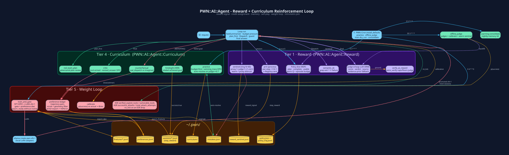

# Reinforcement Learning in pwn-ai

pwn-ai implements a **six-tier** in-context → weight-export RL loop that
combines ORM/PRM, preference ledger, mistake curriculum, env-drift blame,
balanced DPO export, and regression-gated LoRA promotion. On hosts **with a
trainer + GPU**, the full
`Curriculum.practice → Reward.export_dpo → Curriculum.train_and_gate`
path closes the weight loop; without a trainer the path is **export-ready**
(datasets + manual CLI) and the live learning is in-context only.



```
                       ┌────────────────────────────────────────────────┐
        request ──────►│ Loop.run                                       │
                       │  plan_first ─► Curriculum.red_team_plan  (S4)  │
                       │  Dispatch ──► Reward.semantic_ok         (R4)  │
                       │            └► Mistakes.record(cause:)    (E1)  │
                       │  guard ────► Curriculum.counterfactual   (S2)  │──► Reward.record_preference (W1)
                       │  final ────► Curriculum.critic           (S3)  │
                       │            └► Reward.judge (ORM)         (R1)  │──► Reward.verify_as_reward   (E3)
                       │            └► Reward.prm   (PRM)         (R2)  │──► Sessions[step_reward]     (C4)
                       │            └► Curriculum.hindsight       (C3)  │
                       │            └► Curriculum.calibrate       (W3)  │──► Metrics.calibration
                       │            └► Reward.sentinel            (R3)  │──► Mistakes(reward_signal)
                       └────────────────────────────────────────────────┘
                                           │
                    Learning.consolidate (M1 semantic-merge, M3 importance-evict)
                    MemoryIndex.recall_semantic (M2 sim × recency × importance)
                    Registry.rank (C1 α·sim + β·advantage + γ·UCB)
                    Learning.exemplars_for (C2 prioritized replay, C4 minimal trace)
                                           │
              nightly cron ──► Curriculum.practice (S1) ──► Mistakes.resolve ──► preference (W1)
              weekly  cron ──► Curriculum.train_and_gate (W2) ──► LoRA vN+1 ──► A/B gate ──► promote
                                           │
                    Extrospection.correlate rule 9 (E2 causal lead-lag)
                    Metrics.changepoints (E1 CUSUM) ──► Mistakes(cause: :env_drift)
```

## Tier 1 — Reward signal (`PWN::AI::Agent::Reward`)

| ID | Method | What it does | Beats |
|----|--------|-------------|-------|
| **R1** | `.judge` | LLM Outcome Reward Model → `{score:0..1, verdict:, rationale:, key_step:}`. Replaces `infer_success` regex. | Reflexion (binary self-eval) |
| **R2** | `.prm` | Process Reward Model — per-tool-step `+1/0/−1` written into `Sessions[:step_reward]`. | Lightman '23 (math only) — first PRM on security tooling |
| **R3** | `.sentinel` | proxy vs judge vs (1 − user_correction_rate); >0.15 gap → `Mistakes.record(tool:'reward_signal')`. | — novel |
| **R4** | `.semantic_ok` | `grep exit 1` ≠ failure. `Loop.record_metrics` records Metrics on `:ok`, Mistakes on `!semantic_ok`. Kills phantom `31f1871b8a15`. | — bugfix |

## Tier 2 — Credit assignment & replay

| ID | Where | What |
|----|-------|------|
| **C1** | `Registry.rank` + `Metrics.{ucb,thompson,advantage}` | score = α·keyword_sim + β·advantage + γ·UCB1. Untried tools get exploration bonus. |
| **C2** | `Learning.exemplars_for` | priority = judge_score × e^(−Δt/30d) × keyword_sim. |
| **C3** | `Curriculum.hindsight` | HER — relabel failed trajectory with achieved-goal as `success: 'soft'` + tags `hindsight/her/soft`. Soft rows are excluded from SFT and 0.35×-weighted in C2 exemplars. |
| **C4** | `Learning.{compress_exemplar,build_skill_from_session}` | keep only `step_reward > 0` — minimal sufficient trace. |

## Tier 3 — Memory that stays high-signal

| ID | Where | What |
|----|-------|------|
| **M1** | `Learning.consolidate` → `semantic_merge` | embed `:lesson`, greedy cosine ≥0.92, `Reflect.on("merge → 1 imperative")`. |
| **M2** | `MemoryIndex.recall_semantic` | score = 0.6·sim + 0.25·recency + 0.15·importance (Park '23). |
| **M3** | `Memory.remember(source:,confidence:,importance:,ttl:)` | consolidate evicts by `(age/ttl)/(importance×confidence)` — heuristic garbage self-evicts. |
| **M4** | `Learning.note_outcome` | outcomes → `learning.jsonl` ONLY. Memory `:lesson` reserved for reflect/resolve/human. `purge_noise` GCs pre-R1 garbage. |

## Tier 4 — Curriculum & self-play (`PWN::AI::Agent::Curriculum`)

| ID | Method | What |
|----|--------|------|
| **S1** | `.practice` | mine `Mistakes.top` → generate reproducers → self-play → auto-`resolve` on judge≥0.7. |
| **S2** | `.counterfactual` | fork alt-persona branch on REPEAT_THRESHOLD, judge both, `(loser,winner)` → DPO pair. |
| **S3** | `.critic` | tool-armed constitutional critic (can `shell`/`extro_verify` the claim). |
| **S4** | `.red_team_plan` | adversarial plan review grounded in Metrics/Mistakes/extro_drift telemetry. |

## Tier 5 — Close the weight loop

| ID | Where | What |
|----|-------|------|
| **W1** | `Reward.{record_preference,export_dpo}` | 5 free preference sources: user_correction, mistakes_resolve, counterfactual, curriculum, critic. Write-time `WRITE_SOURCE_CAP` + export `DPO_SOURCE_CAP` (≤40%). Trajectory shapes (`winning_trace` / `revised_answer` / `real_dispatch`) force-land. |
| **W2** | `Curriculum.train_and_gate` | SFT+DPO → unsloth/axolotl LoRA → `ollama create pwn-vN+1` → **gate v2** (resolved margin + mean judge + smoke). **Without a trainer: export-only** (`weight_loop: :export_ready`). |
| **W3** | `Curriculum.calibrate` + `Metrics.{record_calibration,calibration}` | plan_first `p(success)` vs actual → per-engine Brier/overconfidence. |

## Tier 6 — Deepen the intro↔extro join

| ID | Where | What |
|----|-------|------|
| **E1** | `Metrics.changepoints` (CUSUM) + `Loop.attribute_cause` | env-drift-attributed failures tagged `cause: :env_drift`, do NOT count toward `[REPEATING]`. |
| **E2** | `Extrospection.correlate` rule 9 | lead-lag: "nmap started failing 2.1h AFTER toolchain.nmap changed" with confidence. |
| **E3** | `Reward.verify_as_reward` | browser-verified verdict caps/floors judge score. Ground-truth reward without a human. |

## Config (`PWN::Env[:ai][:agent]`)

```yaml
:ai:
  :module_reflection: false  # gates Reflect lesson writing (not ORM alone)
  :agent:
    :critic: null            # S3 — nil = ON for remote engines, OFF for ollama
    :red_team_plan: null     # S4 — same auto policy
    :counterfactual: null    # S2 — same auto policy
    :hindsight: true         # C3 (default true; soft-success, 0.35× in C2)
    :verify_as_reward: null  # E3 — nil = auto (~10% local / always remote on CLAIM_RX)
    :reward_llm: null        # nil = ORM/PRM use LLM teacher on remote even if module_reflection is false
    :local_introspect: :failure_only   # ollama cost policy; remote always introspects
    :introspect_every_n: 3
```

## Cron self-improvement

```ruby
# Seeded idempotently by PWN::Cron.install_defaults (pwn setup --migrate):
PWN::Cron.install_defaults
# → curriculum_practice_nightly   0 3  * * *  Curriculum.practice(limit: 3)
# → curriculum_offline_judge     30 3  * * *  Curriculum.offline_judge(since_hours: 24, limit: 40)
# → curriculum_train_weekly       0 4  * * 0  Curriculum.train_and_gate(dry_run: true)  # false only with trainer+GPU
# → learning_consolidate_nightly  0 5  * * *  Learning.consolidate
```

## Tools exposed to the model

`reward_judge` · `reward_prm` · `reward_sentinel` · `reward_warm_sentinel` · `reward_preferences` ·
`reward_scrub_preferences` · `reward_preference_balance` ·
`reward_export_dpo` · `curriculum_practice` · `curriculum_train` ·
`curriculum_hindsight` · `curriculum_offline_judge` ·
`curriculum_preference_balance` · `learning_purge_noise`

## Design claims (architecture — weight promotion requires a trainer)

1. **Process reward on real security tool traces** (R2)
2. **Automatic blame attribution** self vs env-drift via CUSUM×correlate (E1+E2)
3. **Reward-hacking self-detection** (R3)
4. **Mistake-driven curriculum with regression-gated LoRA promotion** (S1+W2)
5. **Five naturally-generated DPO sources** with zero human labelling (W1)


## Operational controls (priority fixes)

| ID | Control | What |
|----|---------|------|
| **P1** | `Curriculum.practice` cooldown + natural prompts | Hard-skips `reward_signal` / parked / `needs_code_change`; N-night zero-score cooldown parks thrash; reproducers are natural user tasks, never signature dumps. |
| **P2** | R4 `semantic_ok` + structured resolve | `31f1871b8a15`-class exit≠0 phantoms stay closed via structured holdouts. |
| **P3** | `Curriculum.offline_judge` | Scores last-24h sessions under ORM/PRM so local `:failure_only` introspect does not starve labels. Cron nightly. |
| **P4** | `Reward.proxy_distrust` | When sentinel fires, Metrics.to_context / Registry.rank haircut proxy rates — actionable, not just another Mistakes row. |
| **R3** | `Reward.sentinel` ring buffer | Fixed-N (`SENTINEL_WINDOW=40`) `{judge,proxy}` window replaces decaying `proxy_sum`/`proxy_n`. Means are always ∈[0,1]; `set_proxy_distrust` refuses proxy∉[0,1]; `reset_sentinel` wipes corrupt state without touching prefs. Legacy decay×`to_i` files auto-clear stuck distrust on load. |
| **P5** | `Curriculum.preference_balance` + `export_dpo` source-cap | Surfaces W1 monoculture **and enforces** ≤40% per source at export (`DPO_SOURCE_CAP`); critic/counterfactual auto-ON for remote engines so the diet rebalances online. |
| **P6** | W2 honesty | Docs + `train_and_gate` return `weight_loop: :export_ready` when `trainer: null`. |
| **P7** | W3 as controller | Engine Brier > 0.35 or overconfidence > 0.25 (n≥8) → force plan_first + critic, cap max_iters at 12. `offline_judge` also records calibration from PLAN `p(success)=` so the controller can fire under `:failure_only`. |
| **P8** | Remote reward teacher | `agent.reward_llm` nil → ORM/PRM use the LLM teacher on remote engines even when `module_reflection` is false. Local ollama stays heuristic unless explicitly enabled. PRM prompts carry R4 tags so benign recon exits score 0 not −1. |
| **P9** | W1 pair geometry + write-time quota | Critic chosen = **revised full answer** (not `CORRECTION:` flaw prose). Resolve prefers `structured_fix.winning_trace`. Counterfactual tags `:real_dispatch` vs `:imagined`. `record_preference` enforces `WRITE_SOURCE_CAP=0.40` online (trajectory shapes force-land). |
| **P10** | `Reward.warm_sentinel` | Backfills R3 ring from scored Learning outcomes so local `:failure_only` hosts reach `SENTINEL_WINDOW` without waiting for live remote introspect. `offline_judge` calls it every night. |
| **P11** | W2 gate v2 | Promote only when candidate wins on resolved margin **and** mean judge **and** frozen smoke set (uname/pwd/ruby) does not regress. Coarse `resolved(N+1)>resolved(N)` alone cannot self-promote eval memorisation. |
| **P12** | SFT quality gate | `export_finetune` drops HER/soft + score&lt;`SFT_MIN_SCORE` (0.6), de-dupes per session by best score, PRM-compresses traces (`compress_finetune_trace`). |
| **P13** | Cron offline_judge dedupe | `install_defaults` treats `offline_judge_nightly` as alias of `curriculum_offline_judge` and disables duplicates so the 30 3 * * * slot runs once. |
| **P14** | Practice → DPO geometry | `Curriculum.practice` records `chosen: winning_trace` (+ final), `shape: :winning_trace` — never first-3-lines fix prose. |
| **P15** | Ledger hygiene | `Reward.usable_preference?` / `scrub_preferences` / geometry filter in `export_dpo` drop `CORRECTION:` prose, resolve-without-trace, and chosen≪rejected. `preference_balance(scrub:true)` reports `trajectory_fraction`. |
| **P16** | R3 warm for real | `warm_sentinel` fills from scored **and** success-boolean outcomes, returns `proxy_distrust`, runs `sentinel` once full so controllers can engage. |
| **P17** | Budget-exhaustion skill | Practice prioritises `agent_loop`/`assistant_answer`; natural prompts teach finish-under-N; Loop hard-stops empty-final thrash and tightens max_iters when budget fingerprints dominate. |
| **P18** | PRM → controller | `Metrics.record_step_reward` + `prm_advantage`; `Registry.rank` adds `δ·prm_advantage` so R2 biases live tool choice. |
| **P19** | Promote diet gate | `train_and_gate` refuses promote unless scrubbed W1 diet has ≥12 pairs, no monoculture, max source ≤45%, trajectory_fraction ≥30%. Export-only stays correct otherwise. |
| **P20** | Judge-blended Metrics | `Metrics.record_judge` / `judge_rate` / `effective_rate` fold episode ORM into per-tool UCB/Thompson/advantage when `proxy_distrust>0`. `exemplars_for` drops success rows with score&lt;0.6 so proxy-true/judge-low cannot be few-shot. |
| **P21** | Resolve trajectory-only | `Mistakes.resolve` writes W1 only when `structured_fix.winning_trace` ≥40 chars (`shape: :winning_trace`). Prose-only resolve still updates Memory + structured_fix; it does **not** flood DPO. |
| **P22** | W3 calibration live | `Loop.plan_first` stashes `p(success)=` on `Thread.current[:pwn_plan_predicted]`; `Learning.recover_predicted_from_session` + `Curriculum.calibrate` light the Brier/overconfidence controller under `:failure_only`. |
| **P23** | Short-horizon budget practice | Budget-exhaustion fingerprints get natural "finish under N" prompts; practice auto-resolve requires N≥2 holdouts at judge≥0.7 **and** a real winning_trace (no long-prose resolve). |
| **P24** | Critic cost under budget-hot | When `budget_exhaustion_hot?`, `auto_introspect` forces `critic(text_only: true)` — single Reflect/heuristic shot, no tool-armed persona swarm that burns the remaining iteration budget. |
| **P25** | Write-time trajectory gate | `Reward.record_preference` refuses non-`TRAJECTORY_SHAPES` unless `force:` / `user_correction`. Write-time source quota **still** applies to trajectory pairs so winning_trace cannot re-monoculture the ledger. |

## Preference / trajectory signal quality (current ops posture)

The in-context loop (R4 + Mistakes + prompt injection) is production-ready.
The **weight path** is export-ready and gated; its bottleneck is pair geometry
and source diversity, not missing tiers:

1. Write-time + export caps keep resolve-monoculture from teaching "emit fix prose".
2. Critic/resolve/counterfactual/**practice** emit **trajectory-shaped** chosen sides (P9/P14).
3. P15 scrub + export geometry filter purge historical prose flood before DPO/LoRA.
4. R3/W3 warm via `offline_judge` + `warm_sentinel` so controllers are not permanently cold on ollama hosts (P10/P16).
5. SFT is filtered as hard as DPO; gate v2 needs smoke + mean, not count alone; P19 also requires trajectory diet.
6. Budget-exhaustion is a first-class curriculum target (P17/P23); PRM step_reward biases `Registry.rank` (P18); critic is text-only when budget-hot (P24); last-iter force-final + no-CF-when-hot + exhaust-path Learning close the bare-string hole.
7. ORM judge blends into Metrics/UCB when distrust is high (P20); W3 calibration lights from plan_first `p(success)=` (P22).
8. Resolve/record_preference are trajectory-only at write time (P21/P25); write-time source quota still caps traj monoculture.
9. Without unsloth/axolotl **or** a clean preference diet, `train_and_gate` stays `weight_loop: :export_ready` (honest).

## Design-priority STATUS (post P14–P25)

Collapse of the review-driven priority order into a living table. Stop minting new P-numbers for chores already covered; track these outcomes instead.

| Pri | ID | Control | Module(s) | Success criterion |
|-----|----|---------|-----------|-------------------|
| **P0** | W1 generator diversity | `Reward::TARGET_SOURCE_MIX` + `generator_mix` + mix-urgent force on critic/counterfactual | `reward.rb`, `curriculum.rb` | `generator_mix.healthy` OR `recommendation` not stuck on `suppress:mistakes_resolve`; trajectory_fraction ≥ 0.5 |
| **P0** | Introspect budget | `Learning::INTROSPECT_SOFT_MS` / `HARD_MS`; stage skip under soft/hard / `budget_exhaustion_hot?` | `learning.rb` | `auto_introspect` returns `stages_skipped` when over soft; post-answer path cannot re-thrash tool critic |
| **P1** | Local judge calibration | Heuristic score shrinkage + `confidence`; `Metrics.effective_rate` scales distrust by `judge_confidence` | `reward.rb`, `metrics.rb` | distrust×heuristic no longer fully replaces proxy; local no-trace highs capped |
| **P1** | Practice outer KPI | `Curriculum.practice_kpi` / `repeating_trend` → `~/.pwn/curriculum_kpi.jsonl` | `curriculum.rb` | week-over-week `delta_repeating` ≤ 0 on budget fingerprints after practice nights |
| **P2** | PRM sample efficiency | `PRM_MIN_N=5`, shrinkage to `PRM_FULL_N=20`, fleet coverage gate in `Registry.rank` | `metrics.rb`, `registry.rb` | `prm_advantage=0` until n≥5; rank delta=0 until ≥3 tools ready |
| **P2** | STATUS over flag archaeology | This table | docs | New work cites Pri/ID here, not fresh P26+ comments for the same theme |
| **ops** | Nightly diet close | `offline_judge` → `scrub_preferences` + `generator_mix` + `practice_kpi` | `curriculum.rb` | Cron path returns `scrub`/`generator_mix`/`practice_kpi`; raw resolve prose does not survive the night |
| **ops** | Shape backfill | `Reward.infer_shape` + scrub rewrite | `reward.rb` | Legacy shapeless rows get `winning_trace`/`revised_answer` when content warrants; traj_f measurable |
| **ops** | Mix in prompt | `Metrics.to_context` emits `W1 MIX:` when unhealthy | `metrics.rb` | Unhealthy diet visible every turn without a tool call |
| **P0** | Budget exhaust deepen | Last-iter force-final (tools=nil); skip CF when `budget_exhaustion_hot?`; tighter caps 8/12; exhaust path `append_session`+`auto_introspect` | `loop.rb` | Exhaust returns a judged final, not a bare string; CF cannot re-enter under hot; last iter cannot tool-call |


### Config additions

```yaml
:ai:
  :agent:
    # P0 introspect budget (ms wall-clock inside auto_introspect)
    # INTROSPECT_SOFT_MS / HARD_MS are constants; override only via code/reload today.
    :critic: null            # also force-on when generator_mix.urgent includes critic
    :counterfactual: null    # also force-on when generator_mix.urgent includes counterfactual
```

### Tools (design-priority)

`reward_generator_mix` · `curriculum_practice_kpi` (plus existing reward/curriculum set)

---

**See also:** [Skills, Memory & Learning](Skills-Memory-Learning.md) ·
[Mistakes](Mistakes.md) · [Cron](Cron.md) · [pwn-ai Agent](pwn-ai-Agent.md)

[← Home](Home.md)
