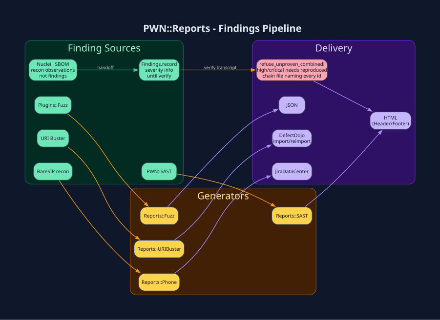

# `PWN::Reports` - Findings Pipeline



> **Install:** `pwn setup --profile vision` - imagemagick · graphviz ·
> rmagick / gruff headers. See [Installation](Installation.md).

## Generators  (`lib/pwn/reports/*.rb`)

| Module | Consumes | Emits |
|---|---|---|
| `Reports::PDF` / `HTML` / `Markdown` / `XML` / `CSV` / `JSON` | findings Hash | `.pdf` / `.html` / `.md` / `.xml` / `.csv` / `.json` |
| `Reports::SAST` | `PWN::SAST::Factory` output | HTML (with `HTMLHeader`/`HTMLFooter`) + JSON |
| `Reports::Fuzz` | `PWN::Plugins::Fuzz` crash log | HTML + JSON |
| `Reports::URIBuster` | `pwn_www_uri_buster` output | HTML |
| `Reports::Phone` | `PWN::Plugins::BareSIP` recon | HTML |
| `Reports::HTMLHeader` / `HTMLFooter` | - | shared chrome for all HTML reports |

## Delivery integrations

| Plugin | Purpose |
|---|---|
| `PWN::Plugins::DefectDojo` | `importscan` / `reimportscan` / `engagement_create` (also `bin/pwn_defectdojo_*`) |
| `PWN::Plugins::JiraDataCenter` | Create issues from findings |
| `PWN::Plugins::SlackClient` / `MailAgent` | Notify |

## Severity and chain gates

`Findings.record` and `record_structured` store `severity: info` and `verification_status: not_executed`. `verify` runs the stored PoC and searches that transcript. The claimed severity is published only when the status is `reproduced`.

`PWN::Reports.report_payload` calls `refuse_unproven_combined!` before a chain leaves the process. It refuses to print `high` or `critical` for a linked pair that is not `reproduced`, or whose combined-impact file does not name every id. Max-of-two is not a chain.

Nuclei and SBOM leads stay recon observations until a later `verify` reproduces them.

## Example

```ruby
findings = PWN::SAST::Factory.start(dir_path: './src')
PWN::Reports::SAST.generate(
  dir_path: './src', results_hash: findings, output_dir: './out'
)
PWN::Plugins::DefectDojo.importscan(
  engagement_id: 42, file: './out/report.json', scan_type: 'PWN SAST'
)
```

[← Home](Home.md) · [SAST](SAST.md) · [Fuzzing](Fuzzing.md)
