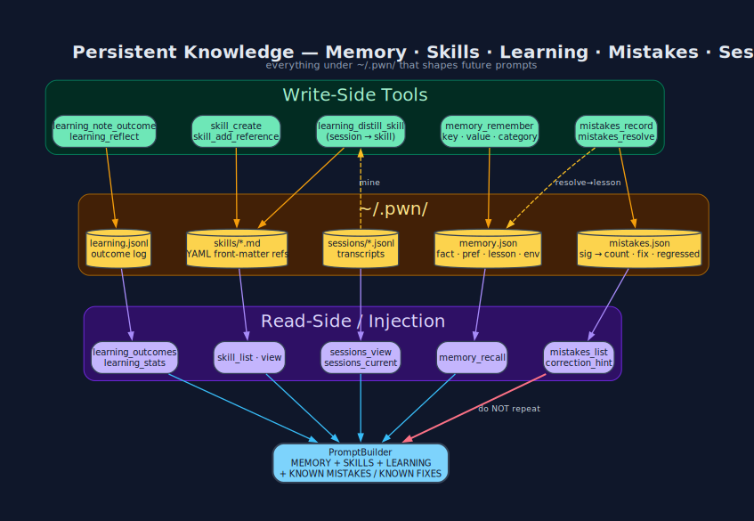

# Memory · Skills · Learning · Mistakes · Metrics — Introspection

The **inward-facing** half of the pwn-ai feedback loop: how the agent measures
its own performance, turns wins into permanent capability, and — critically —
**learns from its own mistakes so it does not repeat them**.



## The five stores

| Store | File | Write tool | Read tool | Injected as |
|---|---|---|---|---|
| **Memory** | `memory.json` | `memory_remember` | `memory_recall` | `MEMORY` block — durable facts / prefs / lessons / env |
| **Skills** | `skills/*.md` | `skill_create` · `learning_distill_skill` | `skill_list` · `skill_view` | `SKILLS` list — reusable procedures + `references:` (CWE/CVE/ATT&CK/NIST/URL) |
| **Learning** | `learning.jsonl` | `learning_note_outcome` · `learning_reflect` | `learning_outcomes` · `learning_stats` | `LEARNING` block — recent outcomes + success_rate |
| **Mistakes** | `mistakes.json` | `mistakes_record` · `mistakes_resolve` · *auto on failure* | `mistakes_list` | `KNOWN MISTAKES` + `KNOWN FIXES` blocks — do-NOT-repeat + do-THIS-instead |
| **Metrics** | `metrics.json` | *automatic* (every Dispatch) | `metrics_summary` | `TOOL EFFECTIVENESS` block — steer tool choice |

## The lifecycle of a lesson

```text
1. Dispatch runs a tool           → Metrics.record(tool, ok?, ms)
   ↳ tool FAILED?                 → Mistakes.record(tool, error)  (count++, cross-session)
   ↳ same sig ≥3×?                → guard_repeated_failure + inline correction_hint
2. Final answer produced          → Learning.auto_introspect(session_id)
3. Reflect finds a durable insight → Memory.remember(lesson_xxxx, …)
4. A whole workflow succeeded      → Learning.distill_skill(name, session_id, references:)
5. Found a fix for a mistake       → mistakes_resolve(sig, fix) → Memory :lesson "AVOID X — FIX: Y"
6. Next launch: PromptBuilder injects all five blocks → the model already knows.
```

See **[Mistakes](Mistakes.md)** for the full negative-feedback mechanics
(fingerprinting, `[REPEATING]`, `[REGRESSED]`, user-correction detection).

## Skill file format

```markdown
---
references:
  - CWE-89
  - T1190
  - https://portswigger.net/web-security/sql-injection
---
# sqli_union_enum

1. Confirm injection with `' AND 1=1 --`.
2. Find column count with `ORDER BY n`.
3. …

## References
- CWE-89
- T1190
```

`PWN::Config.parse_skill_references` reads both the YAML front-matter **and**
the `## References` section, deduplicates, and exposes them via
`skill_view(name)[:references]`.

## Housekeeping

| Tool | When |
|---|---|
| `learning_consolidate(max_entries: 200)` | MEMORY block getting long/noisy |
| `PWN::AI::Agent::Extrospection.revalidate_memory` *(cron)* | MEMORY `:fact` entries getting **stale** — browser-verifies every one containing a CVE/version/URL and prefixes refuted ones `[UNVERIFIED yyyy-mm-dd]` |
| `learning_reset(confirm: true)` | dev-experiment noise polluted success_rate |
| `mistakes_reset(confirm: true)` | new host/engagement — prior failure patterns no longer apply |
| `metrics_reset(confirm: true)` | fixed a broken tool; stale 0 % is misleading |
| `skill_delete(name)` | auto-distilled skill turned out low-quality |
| `learning_auto_introspect_toggle(enabled: false)` | during noisy fuzz loops |

**See also:** [Mistakes](Mistakes.md) — the negative-feedback half ·
[Extrospection](Extrospection.md) — the outward-facing half ·
[Sessions](Sessions.md) · [Persistence](Persistence.md)

[← Home](Home.md)
