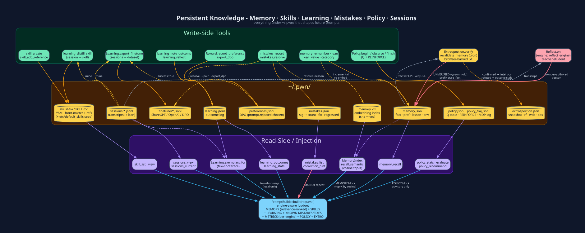

# Memory · Skills · Learning · Mistakes · Metrics · Policy - Introspection

The **inward-facing** half of the pwn-ai feedback loop: how the agent measures
its own performance, turns wins into permanent capability, and - critically -
**learns from its own mistakes so it does not repeat them**.



## The six stores

| Store | File | Write tool | Read tool | Injected as |
|---|---|---|---|---|
| **Memory** | `memory.json` (+ `memory.idx`) | `memory_remember` | `memory_recall` · `PWN::MemoryIndex.recall_semantic` | `MEMORY` block - durable facts / prefs / lessons / env. **Relevance-ranked** for the current request via a local embedding index when `ai.ollama.embed_model` is available; falls back to newest-first otherwise. |
| **Skills** | `skills/<name>/SKILL.md` | `skill_create` · `skill_migrate_legacy` · `learning_distill_skill` | `skill_list` · `skill_view` | `SKILLS` list - reusable procedures + `references:` (CWE/CVE/ATT&CK/NIST/URL) |
| **Policy** | `policy.json` + `policy_traj.jsonl` | Loop `begin_episode` / `observe_step` / `finish` | `policy_stats` · `policy_evaluate` · `policy_recommend` | `POLICY` block - live tabular Q / REINFORCE. Advisory rank only. Disable with `ai.agent.policy: false`. |
| **Learning** | `learning.jsonl` | `learning_note_outcome` · `learning_reflect` | `learning_outcomes` · `learning_stats` · `Learning.exemplars_for` | `LEARNING` block - recent outcomes + success_rate. Prior *successful* traces are also spliced in as **few-shot exemplars** for local models. |
| **Mistakes** | `mistakes.json` | `mistakes_record` · `mistakes_resolve` · *auto on failure* | `mistakes_list` | `KNOWN MISTAKES` + `KNOWN FIXES` blocks - do-NOT-repeat + do-THIS-instead |
| **Metrics** | `metrics.json` | *automatic* (every Dispatch) | `metrics_summary` | `TOOL EFFECTIVENESS` block - steer tool choice. **Segmented per engine** (`engine=...`) so a local model's telemetry never blends with a frontier model's. |

## Memory write guard

`PWN::Memory.save` will not replace a non-empty `memory.json` with an empty
hash unless `force: true` is set. That keeps a bad load/consolidate path from
wiping durable facts, preferences, and lessons. Clearing is still available via
`memory_clear` (uses force) or `save(mem: {}, force: true)`.

## The lifecycle of a lesson

```text
1. PromptBuilder.budget picks per-engine caps → MemoryIndex.recall_semantic
     picks the N MOST-RELEVANT memories for THIS request (not the N newest).
2. (local model) Learning.exemplars_for(request) splices a compressed prior
     successful trace between system and user - 1 concrete example beats 25
     abstract lessons for a small model.
3. (local model) Loop.plan_first forces a numbered tool plan BEFORE dispatch.
4. Dispatch runs a tool              → Metrics.record(tool, ok?, ms, engine:)
   ↳ Policy.observe_step              → hygiene reward (semantic_ok) into the live MDP episode
   ↳ tool FAILED?                    → Mistakes.record(tool, error)  (count++, cross-session)
   ↳ same sig ≥3×?                   → guard_repeated_failure + inline correction_hint
   ↳ (local) ≥ ESCALATE_AFTER_FAILS  → Swarm.ask(escalation_persona) → 3-line frontier hint
5. Agent senses the world (opt)      → extro_verify / watch / rf_tune / osint / serial / telecomm / packet / vision / voice / intel / observe
   ↳ extro_verify → :refuted         → Mistakes.record(tool:'assumption', ...)  # proactive
   ↳ extro_verify → :confirmed       → observe(:intel, ttl:30d)
6. Final answer produced             -> Learning.auto_introspect(session_id)  (deferred after reply by default)
   ↳ Reward.judge (cheap LLM ORM)    → Policy.finish (terminal reward; Q + REINFORCE update)
   ↳ (local) fact_check_local_final  → auto extro_verify every CVE/version claim in the answer
   ↳ if auto_extrospect enabled      → Extrospection.auto_extrospect  # AUTO_SECTIONS only
7. Reflect.on(engine: reflect_engine)→ Memory.remember(lesson_xxxx, ...)   # teacher-student: a
                                       frontier engine may WRITE the lesson a local engine READS
8. A whole workflow succeeded         → Learning.distill_skill(name, session_id, references:)
9. Found a fix for a mistake          → mistakes_resolve(sig, fix) → Memory :lesson "AVOID X - FIX: Y"
10. (weekly, cron) Learning.export_finetune (min judge score + process-reward compress) +
     Reward.export_dpo (per-source cap + trajectory geometry scrub) → ~/.pwn/finetune/*.jsonl → LoRA over the local
     model via Curriculum.train_and_gate (resolved margin + mean judge + smoke) - the ONLY step that
     changes weights, not just the scaffold. Without a trainer this stays export-ready.
11. Next launch: PromptBuilder injects the budgeted blocks → the model already knows:
     MEMORY · SKILLS · LEARNING · KNOWN MISTAKES/FIXES · TOOL EFFECTIVENESS · POLICY · EXTROSPECTION · RECENT TURNS
```

`extro_correlate` is the **join** - it tells the agent whether a failure was
*its* fault (belongs in Mistakes) or *the world* changed (kernel upgrade,
dongle unplugged, target DOM moved). See **[Mistakes](Mistakes.md)** for the
negative-feedback mechanics and **[Extrospection](Extrospection.md)** for the
outward half.

## Skill file format ([agentskills.io](https://agentskills.io) spec)

Each skill lives in its own directory as `~/.pwn/skills/<name>/SKILL.md`.
The name is sanitised to `[a-z0-9-]{1,64}`. Front-matter **must** carry
`name` + `description`; `metadata.references` and `allowed-tools` are
optional.

```markdown
---
name: sqli-union-enum
description: Manual UNION-based SQLi column enumeration and data extraction.
license: MIT
allowed-tools: [terminal, pwn, extrospection]
metadata:
  references:
    - CWE-89
    - T1190
    - https://portswigger.net/web-security/sql-injection
---
# sqli-union-enum

1. Confirm injection with `' AND 1=1 --`.
2. Find column count with `ORDER BY n`.
3. ...

## References
- CWE-89
- T1190
```

`PWN::Config.parse_skill_references` reads both the YAML `metadata.references`
**and** the `## References` section, deduplicates, and exposes them via
`skill_view(name)[:references]`.

Legacy flat `~/.pwn/skills/*.md` files are still read, but
`skill_migrate_legacy` (also run by `pwn setup --migrate --fix`) converts
them in-place to the spec-conformant `<name>/SKILL.md` layout with
back-filled `name`/`description` front-matter. `skill_create` always writes
the new format.

A fresh install (first `pwn` launch or `pwn setup --migrate`) copies these
bundled skills into `~/.pwn/skills/` when the name is missing:

| Skill | For |
|---|---|
| `vulnerability-research-fundamentals` | First-pass research methodology with PWN plugins |
| `deep-exploitation` | Crash / primitive to reliable PoC |
| `bug-bounty-hunting` | Program scope, Burp, authz replay, report |
| `sast-code-scans` | `PWN::SAST::Factory` / `pwn_sast` + reports |
| `reverse-engineering-binaries` | checksec, disasm, `PWN::Plugins::Assembly` |
| `penetration-testing` | PTES / NIST / OSSTMM / ISSAF engagement loop |
| `web-application-penetration-testing` | OWASP WSTG / ASVS / API Top 10 |
| `red-teaming` | MITRE ATT&CK, TIBER-EU, Kill Chain |
| `hardware-and-firmware-testing` | OWASP FSTM / ISTG, serial, firmware |
| `social-engineering` | OSSTMM human channel, ATT&CK phishing |
| `osint` | `extro_osint` kinds, feeds, keys, pivots |

Source: `etc/default_skills/` in the gem. Edits in `~/.pwn/skills` are never
overwritten.

## Housekeeping

| Tool | When |
|---|---|
| `learning_consolidate(max_entries: 200)` | MEMORY block getting long/noisy |
| `PWN::AI::Agent::Extrospection.revalidate_memory` *(cron)* | MEMORY `:fact` entries getting **stale** - browser-verifies every one containing a CVE/version/URL and prefixes refuted ones `[UNVERIFIED yyyy-mm-dd]` |
| `learning_reset(confirm: true)` | dev-experiment noise polluted success_rate |
| `mistakes_reset(confirm: true)` | new host/engagement - prior failure patterns no longer apply |
| `metrics_reset(confirm: true)` | fixed a broken tool; stale 0 % is misleading |
| `skill_delete(name)` | auto-distilled skill turned out low-quality |
| `learning_auto_introspect_toggle(enabled: false)` | during noisy fuzz loops |
| `PWN::MemoryIndex.reset` | new engagement - drop the local embedding index (`memory.idx`) so it rebuilds against the fresh `memory.json` |
| `PWN::AI::Agent::Learning.export_finetune(format: :sharegpt)` | you have enough **high-score** sessions for SFT (drops low scores / HER soft rows and compresses traces by process reward) |
| `memory_lean` / `sessions_lean` / `mistakes_lean` | trim ephemeral or oversized state; never drop protected prefs or open mistakes |
| `learning_gc_stores` | one coordinated lean pass across the RL stores (supports `dry_run: true`) |

## Example questions that trigger Introspection

Natural-language prompts that should fire the **inward** half of the learning
feedback loop (Memory · Skills · Learning · Mistakes · Metrics). Pair these with
the outward catalog in [Extrospection](Extrospection.md#example-questions-that-trigger-extrospection)
when deciding which side of the loop to exercise.

### Memory (`memory_remember`, `memory_recall`, `memory_forget`, `memory_clear`)

- "Remember that our preferred AI engine for long recon chains is `grok`."
- "What do we already know about OpenSSH 8.2p1 from prior sessions?"
- "Forget the stale fact about the old HackRF serial - it was replaced."
- "Store this as a durable lesson: always back up source files before patching."
- "Recall any preference we set for Burp/ZAP proxy ports."

### Skills (`skill_list`, `skill_view`, `skill_create`, `skill_add_reference`, `skill_delete`, `learning_distill_skill`)

- "What skills do we have for SQLi / RDS / GQRX scanning?"
- "Show me the full body of `vulnerability_research_fundamentals`."
- "Distill this successful session into a reusable skill for ADS-B capture."
- "Add CWE-89 and T1190 as references on the `sqli_union_enum` skill."
- "Delete the low-quality auto-distilled skill from yesterday's fuzz loop."
- "Create a skill that walks GQRX remote control → `extro_rf_tune` → observe."

### Learning outcomes & reflection (`learning_note_outcome`, `learning_reflect`, `learning_outcomes`, `learning_stats`, `learning_consolidate`)

- "Record that the video-generation pipeline succeeded (ffmpeg + flite)."
- "What was our success rate over the last 50 attempts?"
- "Reflect on session `20260709_172057_49594079` and extract durable lessons."
- "Show only the recent *failures* tagged with `extrospection` or `rf`."
- "Consolidate near-duplicate MEMORY lessons - cap at 200 entries."
- "Reset learning outcomes; the dev experiment noise polluted the rate." *(destructive)*

### Mistakes / negative feedback (`mistakes_list`, `mistakes_record`, `mistakes_resolve`, `mistakes_reset`)

- "What mistakes keep recurring across sessions?"
- "I just assumed Registry had `.list` - record that as an assumption mistake."
- "Resolve signature `1b6f88b46ce2` - the fix is use `.all` / `.lookup`, not `.list`."
- "Show only unresolved fingerprints sorted by count."
- "That last approach was wrong; fingerprint it so we don't repeat it."
- "Wipe mistakes.json for a clean slate on the new engagement host." *(destructive)*

### Metrics / tool effectiveness (`metrics_summary`, `metrics_reset`)

- "Which tools have the lowest success rate right now?"
- "How often has `shell` been called, and what's its avg duration?"
- "Is `extro_rf_tune` healthier than the old GQRX helpers by metrics?"
- "Reset metrics after we fixed the broken tool so the 0 % doesn't steer us away." *(destructive)*

### Sessions / transcripts (`sessions_list`, `sessions_view`, `sessions_current`, `sessions_stats`, `sessions_delete`)

- "What's the active session id?"
- "List the last 10 sessions and their sizes."
- "Open session X and show the last 50 turns (truncated)."
- "How much disk are session transcripts using overall?"
- "Delete the noisy fuzz-experiment transcript so reflect() stays high-signal."

### Loop toggles & housekeeping

- "Disable auto-introspect while we fuzz; re-enable for the summary turn."
- "Is auto-introspect currently on?"
- "Revalidate MEMORY facts that contain CVEs / versions / URLs." *(joins Extrospection.revalidate_memory)*
- "Why did that tool start failing - my fault or world drift?" → `extro_correlate` then Mistakes vs Learning

### Short "trigger" patterns the agent should recognize

| Pattern | Likely tools |
|--------|----------------|
| "Remember / recall / forget that..." | `memory_remember` / `memory_recall` / `memory_forget` |
| "What skills do we have for... / distill this" | `skill_*` / `learning_distill_skill` |
| "Did that work? / note the outcome / success rate" | `learning_note_outcome` / `learning_stats` |
| "Reflect on this session / extract lessons" | `learning_reflect` / `sessions_current` |
| "Don't do that again / that was wrong / resolve..." | `mistakes_record` / `mistakes_resolve` / `mistakes_list` |
| "Which tools are unhealthy / avg duration" | `metrics_summary` |
| "What did the live policy learn / suggest a tool" | `policy_stats` / `policy_evaluate` / `policy_recommend` |
| "What did we run in session X / active session" | `sessions_view` / `sessions_current` |
| "Disable reflection while we fuzz" | `learning_auto_introspect_toggle` |

Contrast with **Extrospection** examples: weather in Chicago, "what's on 101.1",
CVE fact-checks, and host drift are *outside-world* senses. The table above is
purely *self* measurement - how well the agent did, what it must stop repeating,
and which procedures to promote permanently.

**See also:** [Mistakes](Mistakes.md) - the negative-feedback half ·
[Extrospection](Extrospection.md) - the outward-facing half ·
[Sessions](Sessions.md) · [Persistence](Persistence.md)


## Live Policy (advisory Q / REINFORCE)

When `ai.agent.policy` is on (the default), every Loop turn is one learning
episode:

1. `begin_episode` opens before the first tool rank.
2. `observe_step` writes a hygiene reward after each tool (`semantic_ok`).
3. `finish` (from `Learning.auto_introspect`, or Loop if introspect is skipped)
   adds the `Reward.judge` terminal score and updates Q and REINFORCE.

State is a short key: request kind, a hash of the active English task, last
action, fail count bin, and engine. Files:

- `~/.pwn/policy.json` - Q table, REINFORCE logits, visit counts, recent returns
- `~/.pwn/policy_traj.jsonl` - episode log

Tools `policy_stats`, `policy_evaluate`, and `policy_recommend` are read-only. Reset is Ruby-only (`PWN::AI::Agent::Policy.reset`) so a tool call cannot wipe the table. `Registry.rank` may add a small Q-advantage after a pair has been visited at least twice. Planning still owns the task list.

Turn it off with `ai.agent.policy: false` in `~/.pwn/pwn.yaml`.

## Task briefs vs learning

`TaskSummarizer` is **UX**, not a persistence layer. Plan/`about_to` lines are ephemeral TUI briefs (deduped by `last_brief_fp`). Durable learning still flows through Learning · Mistakes · Reward · Policy · sessions. See [pwn-ai Agent § Task summaries](pwn-ai-Agent.md#task-summaries-long-autonomous-turns).

[← Home](Home.md)
