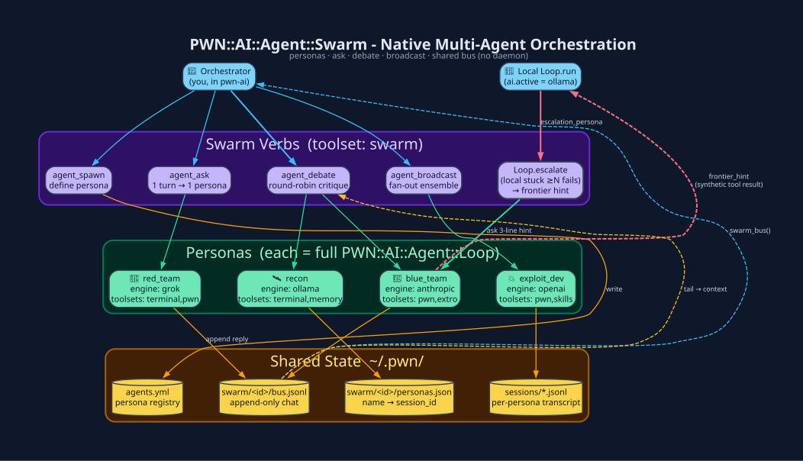

# Swarm - Native Multi-Agent Orchestration

`PWN::AI::Agent::Swarm` is first-class multi-agent orchestration built
directly on `PWN::AI::Agent::Loop`. Each persona is a *full* tool-calling agent - Memory,
Skills, Learning, Metrics and Extrospection all apply - so the
self-improvement loop covers the whole swarm.



## Files

| Path | Contains |
|---|---|
| `~/.pwn/agents.yml` | Persona registry (name → role/engine/model/toolsets/max_iters) |
| `~/.pwn/swarm/<id>/bus.jsonl` | Append-only chat every persona reads/writes |
| `~/.pwn/swarm/<id>/personas.json` | persona name → `PWN::Sessions` id |

No daemon. Cross-session / cross-process communication == another `pwn-ai` (or
a `PWN::Cron` job) calling `Swarm.ask` with the same `swarm_id`.

## Run one mission with a built-in team

```text
/swarm mission Write and test a Ruby function that validates the supplied data format
```

No persona setup is required. The exact text after `/swarm mission ` remains the
user request for **every** role; role instructions and JSON handoffs go in system
context, not a replacement task. Empty requests fail before dispatch. Existing
`dm`, `broadcast`, and `debate` retain their messaging semantics. `/swarm agents`
lists available personas; `/swarm dm NAME REQUEST` messages one persona.
The renamed slash commands replace the previous spellings without compatibility
aliases. Ruby APIs `Swarm.solve`, `Swarm.ask`, and the `Solve` coordinator are unchanged.

`/menu` and Tab use case-insensitive alphabetical ordering at every depth:
root commands, command actions, and live parameter lists (including agents,
jobs, MCP tools, sessions, skills, memory keys, and cron jobs). Exact spelling
breaks case-insensitive ties; selections keep their original command payloads.

1. **Antagonist** independently enumerates requirements and risks before seeing
   a candidate. `R0` always contains the entire unchanged original request.
2. **Protagonist** builds the candidate using the ordinary nested tool-calling
   `Loop.run` through `Swarm.ask`, then declares relative artifact paths.
3. **Antagonist** critiques the candidate and returns unresolved objections.
4. **Verifier** proposes requirement-indexed commands and exact expected stdout.
   The coordinator executes them via the registered `shell` tool and `Dispatch`,
   capturing actual stdout, stderr, and exit status. Model-supplied observations
   are never accepted as execution evidence.
5. **Integrator** reviews those observations and either accepts or sends a
   targeted repair to the protagonist. Repairs always repeat critique and tests.

Acceptance additionally requires every requirement ID to have passing executed
evidence, no open objections, every check to exit zero with its expected output,
and unchanged artifact hashes and steering revision. A model's `accept` alone
cannot complete the job. Candidate and handoff revisions are SHA-256-bound;
changed files, stale handoffs, failed checks, uncovered requirements, malformed
JSON, provider failures and limits return **INCOMPLETE**, never success. Structured
records and raw execution observations are saved with owner-only permissions in
`~/.pwn/swarm/<solve-id>/solve.json`. Every solve gets fresh role sessions, so an
earlier candidate cannot contaminate the independent initial assessment.

### Console and controls

Open the swarm workspace with **Ctrl+S / Ctrl+G**, keep a mission in the composer,
then press **v — Mission with team**. Enter confirms the exact draft and built-in
roles; Esc aborts without changing the draft or cursor. The jobs detail view
shows actual role phases, original requirements, provider/model routes, artifact
hashes, and open objections. There is one integrated final result. Provider usage
continues through the console's existing usage observer (no invented estimates).

```text
/swarm status JOB
/swarm steer JOB Add this verification constraint
/swarm pause JOB
/swarm resume JOB
/swarm cancel JOB
```

The same slash routes work in the legacy line console. Steering belongs to the
coordinator and is propagated to later roles; it invalidates previously accepted
candidate evidence without replacing the original goal. Pause stops future
dispatch at safe boundaries. Cancel interrupts the owned model wait; an already
running tool finishes first, and its changes are not undone. Another job cannot
start in the same controller while solve owns the workspace. A workspace file
lock also excludes overlapping solve coordinators across processes.

### Role configuration and limits

All roles inherit the already selected provider and that provider's configured
default model. Optional overrides use **existing** persona fields; no new vault
configuration keys or schema migration is needed:

```text
/swarm spawn solve_antagonist Review correctness --engine ollama --model YOUR_INSTALLED_MODEL
```

The other names are `solve_protagonist`, `solve_verifier`, and `solve_integrator`.
They can also be defined in `agents.yml`. Engine/model overrides are request-local;
there is no superiority ranking, automatic diversity, or fallback to a different
provider. Remote credentials must already be configured. Solve never initiates
OAuth login or prompts for API keys; configured OAuth refresh remains the provider's
normal noninteractive operation. Implicit local-agent escalation is disabled for
solve. A missing provider fails visibly rather than silently switching.

Ruby API: `Swarm.solve(request:, workspace: Dir.pwd, rounds: 3, swarm_id: nil,
steering: nil, on_state: nil, on_tool: nil, usage_observer: nil)`. `swarm_id` supplies
role overrides; the returned solve ID identifies the independent records. The
default round limit is 3 (API range 1–10), each role turn is limited to 25 model
calls, and each of at most 32 checks per round has a 60-second tool timeout.

### Boundaries, not a security sandbox

The protagonist is the only model role with write-capable tools (`shell` and
`pwn_eval`). Review roles have no tools; Dispatch denies invented tool calls even
if a provider ignores its empty tool schema. Integrator repairs are dispatched
back to that one writer. This is role capability enforcement, **not** confinement
of arbitrary protagonist Ruby or shell code or other processes on the host.

Verification runs in fresh disposable copies of declared regular-file artifacts;
all test dependencies must be declared. Symlinks/out-of-workspace artifacts are
rejected, and input copies must retain their candidate hashes after a check.
Files over 128 KiB cannot currently be passed to full-content review and produce
an explicit incomplete result. A disposable directory is **not an OS sandbox**:
test code can use absolute paths, network, installed dependencies and host resources.
Existing Dispatch confirmation and `ai_sandbox` policies still apply. Use only
trusted test commands or supply external OS isolation when executing untrusted code.

Requirement extraction and test relevance still require model judgment. Executed
checks are evidence for their stated assertions, not mathematical proof of an
arbitrary natural-language goal; the saved commands, outputs, requirements and
revisions make that judgment inspectable. No live-provider reliability or automatic
security isolation is implied by the deterministic offline integration tests.

## Define personas

Each persona accepts optional `engine` and `model` keys. `model` is the exact
provider model identifier (case and punctuation are preserved). Omit `engine`
to inherit the active engine; omit `model` or leave it blank to use the selected
provider's configured default model. Existing engine-only entries still work.

For example, edit `~/.pwn/agents.yml`:

```yaml
reviewer:
  role: Review implementation and tests.
  engine: openai
  model: gpt-6-astra
  toolsets: [terminal, pwn]
local_reviewer:
  role: Independently review implementation and tests.
  engine: ollama
  model: your-installed-model:tag
  toolsets: [terminal, pwn]
```

Replace model identifiers with models available to your configured providers.
Personas can use different models on the same provider or different providers.
The selection applies to `ask`, `debate`, and `broadcast`; overrides are scoped
to each persona execution, restored after nested calls/errors, and do not rewrite
global provider defaults. An omitted model uses the provider default, not an
enclosing persona's model override. Provider authentication is unchanged.

`agent_spawn` also accepts `model:` and `agent_list` reports it.

On upgrade, `pwn setup --migrate` applies schema 3: existing persona entries
without a `model` key receive an unset YAML `model:` field (null, meaning the
selected provider's default). Existing model values, engine selections, and
custom persona fields are preserved. Re-running migration makes no further
changes. A missing `agents.yml` is not created by this migration.

```ruby
agent_spawn(name: 'red_team',
            role: 'Offensive operator. Propose the most aggressive next step.',
            engine: 'grok',
            toolsets: %w[terminal pwn memory skills extrospection])

agent_spawn(name: 'blue_team',
            role: 'Defender. Critique red_team, flag detection risk & OPSEC.',
            engine: 'anthropic',
            toolsets: %w[pwn memory extrospection])
```

> Omit `swarm` from a persona's toolsets to stop it recursively spawning
> further sub-agents. Recursion is also hard-capped by
> `PWN::Env[:ai][:agent][:max_depth]` (default 3).

## Verbs

| Tool | Use for |
|---|---|
| `agent_list` | See who's defined |
| `agent_spawn` | Define / overwrite a persona |
| `agent_ask(name, request)` | One turn of one persona → reply comes back to *you* |
| `agent_debate(names, topic, rounds:)` | Round-robin critique - each sees the bus tail |
| `agent_broadcast(request)` | Fan-out; returns `{name => reply}` for voting |
| `swarm_bus(swarm_id)` | Tail a bus to inspect a prior/concurrent conversation |
| `swarm_list` | Find a `swarm_id` to resume |


## Escalation persona (local-model circuit-breaker)

`Loop.run` also uses Swarm *implicitly*. When the active engine is `ollama`
and `ai.agent.escalation_persona` names a persona here, the loop counts
in-turn tool failures; once ≥ `Loop::ESCALATE_AFTER_FAILS` (default 4) it
calls `Swarm.ask(name: <persona>, request: "Local agent is stuck on: ... Give a
3-line corrective hint")` and injects the reply as a synthetic
`frontier_hint` tool result. The **local model still authors the final
answer** - Learning / Metrics stay attributed to `:ollama`, and every
escalation is fingerprinted into `Mistakes` (tool: `'escalation'`) so
`export_finetune` can later teach the local model to *not* need it.

```yaml
# ~/.pwn/pwn.yaml
ai:
  agent:
    escalation_persona: blue_team   # any persona in ~/.pwn/agents.yml
```

## Example: adversarial exploit review

```ruby
tx = agent_debate(
  names:  %w[red_team blue_team exploit_dev],
  topic:  'Target runs Jenkins 2.426.2 on :8080 - plan initial access.',
  rounds: 3
)
# later, in a different pwn-ai process:
agent_ask(name: 'red_team', swarm_id: tx[:swarm_id],
          request: 'blue_team raised WAF concerns - revise the payload.')
```

Each persona can pin a **different engine and/or model**, rather than requiring
every persona to use one provider's default model.

**See also:** [pwn-ai Agent](pwn-ai-Agent.md) ·
[Agent Tool Registry](Agent-Tool-Registry.md) · [Sessions](Sessions.md)

[← Home](Home.md)
