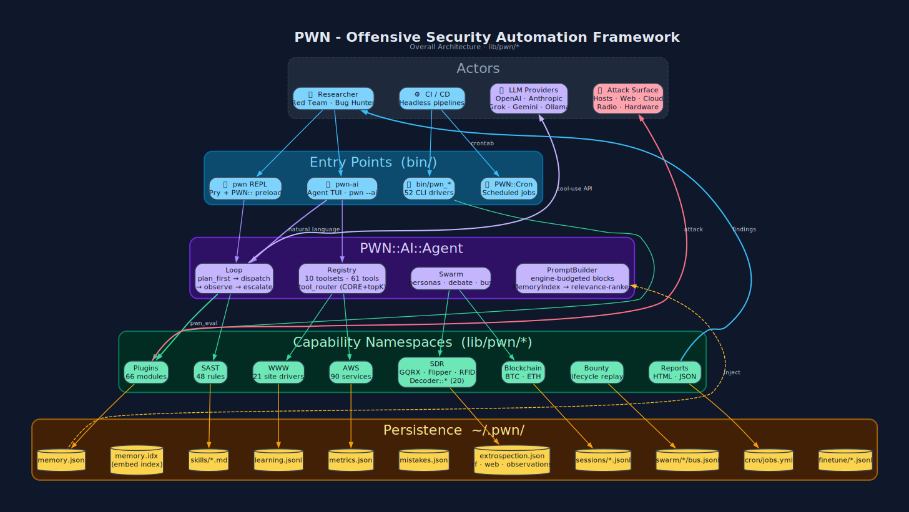

# What is PWN

**PWN** (pronounced /pōn/ - "pone") is an open-source **offensive-security
automation framework** and **continuous-security-integration** platform,
distributed as a Ruby gem.

It gives security researchers, red teamers, bug-bounty hunters and DevSecOps
engineers a single, scriptable surface over the entire offensive toolchain -
from OSINT and network discovery, through web/cloud/hardware/radio
exploitation, to reporting and disclosure - and puts a **self-improving,
tool-calling AI agent** on top of it.

## In numbers

| Namespace | Count | What it is |
|---|---|---|
| `PWN::Plugins::*` | **66** | Wrappers for external + native tooling (Burp, Nmap, Metasploit, Shodan, browsers, serial, ...) |
| `PWN::SAST::*` | **48** | Static-analysis rules across C/Java/Go/Python/Ruby/Scala/PHP/TS |
| `PWN::AWS::*` | **90** | One module per AWS service for cloud enumeration |
| `PWN::WWW::*` | **21** | Site-specific browser automations (HackerOne, BugCrowd, Google, LinkedIn, ...) |
| `PWN::SDR::*` | **6** (+ **20** decoders) | GQRX, FlipperZero, RFIDler, SonMicro, band tables, `Decoder::{ADSB,POCSAG,RDS,LoRa,...}` |
| `PWN::FFI::*` | **8** | Native DSP/RF backends: Volk · Liquid · FFTW · RTLSdr · HackRF · AdalmPluto · SoapySDR · Stdio |
| `PWN::AI::*` | **5** engines | OpenAI, Anthropic, Grok (OAuth device-flow), Gemini, Ollama |
| `bin/pwn_*` | **53** | Headless CLI drivers for CI/CD |
| Agent toolsets | **10** · **71 tools** | terminal · pwn · memory · skills · sessions · learning · metrics · extrospection · cron · swarm |

## The three ways to use it

1. **`pwn` REPL** - a Pry shell with the whole `PWN::` namespace pre-loaded.
   Prototype an attack chain interactively, one method call at a time.
2. **`pwn-ai`** - a natural-language TUI (or `pwn --ai "..."` one-shot) where an
   LLM plans and executes those same method calls for you, records what
   worked, and gets better at it.
3. **`bin/pwn_*` drivers** - thin CLIs over the plugins, for cron and CI/CD.

## What makes it different

- **Everything is Ruby, everything is a method.** No YAML DSLs, no plugins-in-a-
  black-box. If you can call it in the REPL, the AI agent can call it, a driver
  can call it, and a cron job can call it.
- **Closed self-improvement loop.** Metrics + Learning + **Reward** (ORM/PRM
  judge, sentinel) + **Curriculum** (mistake-driven self-play, HER,
  regression-gated LoRA) on the introspection side; Snapshot + Drift + Intel
  + Verify on the extrospection side; joined by `extro_correlate`, which
  tells the agent whether a failure was *its* fault or *the world* changed -
  and writes the lesson back into the prompt for next time.
- **Native multi-agent.** `PWN::AI::Agent::Swarm` runs personas (each a full
  tool-calling agent, optionally on a *different* LLM engine) that debate,
  broadcast and share an append-only bus - no IRC daemon, no external service.
- **Self-healing state.** `PWN::Setup` (doctor/provisioner) + `PWN::Migrate`
  (schema-stamped `~/.pwn` verifier/auto-migrator) make `gem install pwn` →
  `pwn setup` the entire install *and* upgrade story on every OS.

**Next:** [Why PWN](Why-PWN.md) · [How PWN Works](How-PWN-Works.md) ·
[Installation](Installation.md)

[← Home](Home.md)
