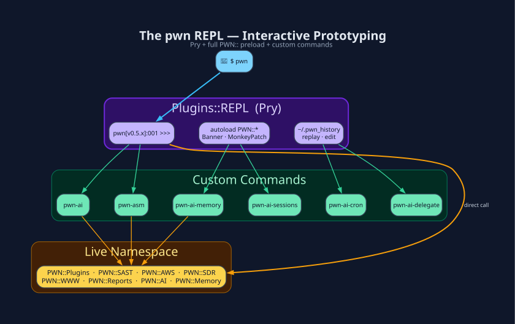

# The `pwn` REPL

`pwn` launches a **Pry** session with the entire `PWN::` namespace already
`require`d, a themed prompt, a persistent history file, and a set of custom
commands.



## Why Pry (not IRB)?

- `ls PWN::Plugins::BurpSuite` - instant method listing
- `show-source` / `show-doc` - read any plugin without leaving the shell
- `edit -m` - patch a method live and retry
- `wtf?` - full backtrace of the last exception
- `history --replay 5..12` - re-run a range of lines

## Custom commands

| Command | Implemented in | Purpose |
|---|---|---|
| `pwn-ai` | `Agent::Loop` | Enter the AI agent TUI |
| `pwn-vault` | `PWN::Plugins::Vault` | Decrypt, edit `~/.pwn/pwn.yaml`, re-encrypt. Stays in the editor until `PWN::Config` accepts the file. |
| `pwn-asm` | `Plugins::Assembly` | Multiline asm ↔ opcodes workbench |
| `pwn-mesh` | `Meshtastic` gem | Meshtastic serial / bluetooth / TCP / MQTT client (Ruby ≥ 4.0; `plugins.meshtastic.transport`). Inside the mesh TUI, leading-slash menus (`/channel`, `/transport`, `/device`, `/status`, `/help`, `/back`) configure the session locally and are not sent as mesh text. TAB completes those commands. |
| `pwn-ai-memory` | `PWN::Memory` | View/edit persistent memory |
| `pwn-ai-sessions` | `PWN::Sessions` | List/view/delete transcripts |
| `pwn-ai-cron` | `PWN::Cron` | List/run/toggle scheduled jobs |
| `pwn-ai-delegate` | `Agent::Swarm` | Send one request to a persona |
| `pwn-irc` | *(deprecated)* | Prints a pointer to `Agent::Swarm` - the IRC daemon transport is gone |
| `toggle-debug` | `Agent::Loop` / `Plugins::Log` | Stage log per operator request to `/tmp/pwn-ai-DEBUG-<SESSION_ID>-RN.log` |
| `toggle-trace` | `Agent::Loop` / `Plugins::Log` | Turns `toggle-debug` on with TracePoint; ENTER after each engine/tool step. Pry.config, not Env. Off turns both off. |
| `toggle-pwn-ai-speaks` | `Plugins::Voice` | TTS every final answer on/off |
| `welcome-banner` | `PWN::Banner` | Redraw a random banner |
| `toggle-pager` | Pry | Page long output on/off |
| `back` | - | Leave `pwn-ai` / `pwn-asm` / `pwn-mesh` sub-REPL |

## pwn-mesh slash commands

Typed at the mesh TX prompt (leading `/`). `/` or `/menu` opens a boxed curses menu (arrows/j/k, Enter, Esc). `/channel`, `/transport`, and `/device` without an argument open the same kind of list. Explicit `/channel LongFast` still jumps without a menu. Commands are local — they are not published as Meshtastic text. Changes update `PWN::Env[:plugins][:meshtastic]` and persist to `~/.pwn/pwn.yaml` when the vault decryptor is available; a live session reconnects so RX follows the new channel or radio.

| Command | Purpose |
|---|---|
| `/help` | List mesh slash commands |
| `/status` | Show active transport, device, and channel |
| `/channel list` | List named `plugins.meshtastic.channel` blocks (`*` = active) |
| `/channel <name>` | Switch the active channel (e.g. `LongFast`) |
| `/transport list` | List `auto` / `serial` / `bluetooth` / `tcp` / `mqtt` |
| `/transport <kind>` | Pin a connection type (`auto` re-enables serial → bluetooth → tcp → mqtt probe) |
| `/device list` | List serial ports, BLE Meshtastic addresses, or the configured TCP/MQTT host |
| `/device <id>` | Switch radio for the active transport (`/dev/ttyACM0`, BLE MAC, `host:port`) |
| `/msg [!nodeid|channel] <text>` | Send a DM to `!nodeid`, or a broadcast on a named channel. Omit the target to reuse the last incoming DM sender or channel. A compose line without `/msg` goes to the active channel. Also `@!aabbccdd text` on a normal send. |
| `/toggle-dispatch-to-pwn-ai` | Off by default. When on, pwn-ai answers only if the source channel is encrypted, listed in `plugins.meshtastic.ai_whitelist`, and the text begins with `@ai`. DMs are allowed when they reside on a whitelisted channel. Uses `PWN::Env[:ai][:active]`. |
| `/back` | Leave pwn-mesh (same as `back` / CTRL+D) |

Typing `/` shows matching commands in the TX pane (ncurses hides Reline's dropdown). TAB still completes `/…` commands, channel names, transports, and device ids.

## Multi-line input

`pwn-ai` and `pwn-asm` use a custom `PWNMultiLineInput` reader. Plain
**ENTER** submits; insert a newline (keep composing) with **any** of:

| Keystroke | Works on | Notes |
|---|---|---|
| **SHIFT + ENTER** | kitty · wezterm · foot · alacritty · ghostty · xterm · Konsole · iTerm2 · Windows Terminal · Terminator¹ | preferred; requires the emulator to encode modified Enter |
| **ALT + ENTER** | *everything*, incl. all VTE terminals | universal fallback - every emulator sends `\e\r` |
| trailing **`\`** + ENTER | *everything* | bash/irb/psql-style continuation; `\` is stripped on submit |

¹ Terminator (and every other libvte host - GNOME Terminal, Tilix,
xfce4-terminal, Guake, Ptyxis) cannot distinguish SHIFT+ENTER from
ENTER at the escape-sequence level ([GNOME/vte #2601](https://gitlab.gnome.org/GNOME/vte/-/issues/2601),
[#2607](https://gitlab.gnome.org/GNOME/vte/-/issues/2607)). For
Terminator specifically, pwn ships a GTK plugin that fixes it - install
with:

```console
$ pwn setup --terminal
```

This is **opt-in** and **one-time**: it copies
`third_party/terminator/pwn_shift_enter.py` →
`~/.config/terminator/plugins/`, enables it in
`~/.config/terminator/config` (backup taken), and prints the
`~/.tmux.conf` lines below. pwn will **never** touch your terminal
emulator's config on its own.

> **tmux users:** requires `set -s extended-keys on` **and**
> `set -as terminal-features '<outerTERM>*:extkeys'`. pwn sets both at
> runtime and tells you what to add to `~/.tmux.conf`; `pwn setup
> --terminal` prints the same. See
> [Troubleshooting](Troubleshooting.md#shiftenter-submits-instead-of-newline).

## History → Driver

`~/.pwn_history` captures every line you type. When a sequence works, turn it
into a shipped `bin/pwn_*` driver - see
[From REPL History to Driver](Drivers.md).

**Next:** [pwn-ai Agent](pwn-ai-Agent.md) · [CLI Drivers](CLI-Drivers.md)

[← Home](Home.md)
