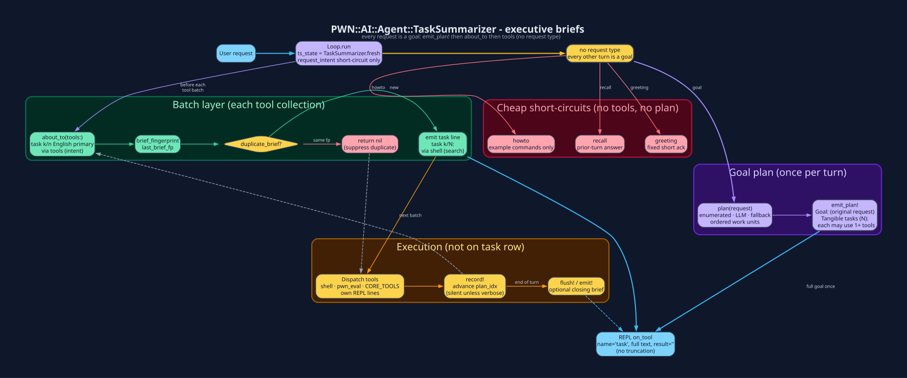

# `pwn-ai` - The Autonomous Agent

`pwn-ai` is a natural-language front end to everything in `PWN::`. You describe
the goal; the agent plans a sequence of tool calls (`pwn_eval`, `shell`,
`memory_*`, `skill_*`, `mistakes_*`, `reward_*`, `curriculum_*`, `extro_*`,
`agent_*`, ...), executes them against the live process, observes the results,
and loops until it can give you a final answer - **learning from every failure
so it doesn't repeat it**.

## Two ways to run it

```text
# 1. Interactive TUI (inside the pwn REPL)
pwn[CURRENT_VERSION]:001 >>> pwn-ai
✨ pwn-ai · anthropic · session 20260707_225041_d7f2f3bb
> Use NmapIt to sweep 10.0.0.0/24, then TransparentBrowser via Burp on any
 host with 443 open, active-scan, and give me a Reports::SAST summary.
```

```bash
# 2. Headless one-shot (CI-friendly)
$ pwn --ai "run bin/pwn_sast against ./src and push findings to DefectDojo"
```

## Anatomy of a turn

1. **PromptBuilder** assembles the system prompt: your request + **six
 engine-budgeted blocks** - MEMORY (relevance-ranked via `PWN::MemoryIndex`
 when a local embedding model is reachable) · SKILLS · LEARNING ·
 **KNOWN MISTAKES / KNOWN FIXES** · TOOL EFFECTIVENESS (**per-engine**) ·
 **EXTROSPECTION** (live host fp + drift + fresh observations including
 `:rf` now-playing and `:web` DOM watches). `PromptBuilder.budget` shrinks
 each block for local engines so a small model spends its attention on the
 task, not the harness.
2. **Loop** checks the incoming message against `Mistakes::CORRECTION_RX` - if
 it reads like *"no, that's wrong"* the previous outcome is flipped to
 `success:false`, fingerprinted, **and recorded as a `(prompt, rejected,
 chosen)` DPO preference pair** in `~/.pwn/preferences.jsonl`.
3. **Registry** hands Loop the tool schemas - the full set for frontier
 engines, or `CORE_TOOLS` + top-K keyword-relevant when
 `ai.agent.tool_router` is on. *(local)* `Learning.exemplars_for` splices a
 compressed prior-success trace as few-shot; *(local)* `plan_first` forces a
 numbered tool plan before the first dispatch (optionally red-teamed by
 `Curriculum.red_team_plan`).
4. **TaskSummarizer** (if `ai.agent.task_summary` is on, default true):
 `emit_plan!` prints the full goal + numbered tangible tasks once on
 submit. Before each tool *collection*, `about_to` emits a single
 `name='task'` brief built from `capability_label` +
 `tool_counts_phrase` + `intent_phrase` (e.g. `search`/`edit`/`read`/
 `test`/`mutate-ruby`), tied to the active plan item. Identical briefs
 are suppressed via `last_brief_fp` (returns `nil` → no second line).
 Full goal text is **not** restated on every batch when a plan exists.
 `Loop.task_summary_about_to!` is the sole about_to entry path.
5. Loop sends the prompt to the active `PWN::AI::<Engine>` client.
6. Provider replies with `tool_calls` → **Dispatch** executes each one via the
 [Registry](Agent-Tool-Registry.md); **Metrics** records
 `duration/success/engine` (via `Reward.semantic_ok` - `grep` exit 1 ≠
 failure). Dispatch is *tolerant* - Levenshtein-repairs near-miss tool names
 and cleans up almost-JSON args, fingerprinting every repair into
 **Mistakes**. Any *failure* is fingerprinted (`count++`, cross-session) and
 the tool result gets an inline `correction_hint`
 (`seen N×, sig=..., KNOWN FIX: ...`) so the very next iteration
 self-corrects. If the persistent count ≥ 3, `guard_repeated_failure`
 interrupts with an explicit *change-approach* instruction (optionally
 forking a `Curriculum.counterfactual` A/B branch). *(local)* once in-turn
 failures ≥ `ESCALATE_AFTER_FAILS`, `Loop.escalate` asks the
 `ai.agent.escalation_persona` Swarm persona for a 3-line frontier hint and
 injects it as a synthetic tool result. On-demand sense tools
 (`extro_verify` / `extro_watch` / `extro_rf_tune` / `extro_osint` /
 `extro_serial` / `extro_telecomm` / `extro_packet` / `extro_vision` /
 `extro_voice` / `extro_intel`) fire here when the question needs the
 outside world; a `:refuted` verify is itself recorded as a Mistakes
 `assumption` fingerprint.
7. Results are appended to the message list; go to 5.
8. When the reply has *no* tool_calls it's the **final answer** →
 `Learning.auto_introspect` fires (if enabled): *(local)*
 `fact_check_local_final` auto-`extro_verify`s every CVE / version-shaped
 claim in the answer; **`Reward.judge`** scores (request, final) →
 `{score, verdict, rationale}`; **`Reward.prm`** back-labels each transcript
 step with `step_reward:+1/0/-1`; failed goals are optionally HER-relabeled
 by `Curriculum.hindsight`; `Reflect.on` writes durable lessons via
 `ai.reflect_engine` (teacher-student - a frontier engine may author the
 lesson a local engine reads); `Reward.sentinel` warns when success_rate ≠
 judge_mean ≠ (1 - user_correction_rate); when `auto_extrospect` is also on,
 `Extrospection.auto_extrospect` runs (`AUTO_SECTIONS = host/repo/env` only -
 never toolchain/rf/web, never launches Burp/ZAP/msf/gqrx). Transcript is
 flushed to `~/.pwn/sessions/`.


## What the agent can call

12 toolsets · **82 tools** - full table at
[Agent Tool Registry](Agent-Tool-Registry.md).

The two that matter most:

| Tool | Reach |
|---|---|
| `pwn_eval` | **Any** Ruby in-process - the whole `PWN::` namespace, `require`, monkey-patch, everything |
| `shell` | **Any** OS command on the host |

Everything else (memory, skills, learning, **mistakes**, **reward**,
**curriculum**, extrospection, cron, swarm, sessions, metrics) is a
convenience wrapper the model can discover from the schema alone.

## Delegating to other agents

`agent_ask`, `agent_debate`, `agent_broadcast` spin up **sub-agents** (each a
full `Loop.run` under a persona overlay) that share a JSONL bus. See
[Swarm](Swarm.md).


## Task summaries (long autonomous turns)

`PWN::AI::Agent::TaskSummarizer` keeps the TUI readable during multi-step work:

| Surface | When | Content |
|---|---|---|
| `emit_plan!` | User submit | **Full** goal + ordered plain-English tangible tasks (each may need many tools) |
| `about_to` | Before each tool batch | **Primary:** `task k/n: <english>` - **secondary:** `via shell×2 (search)` (not raw argv) |
| `plan_context` / `active_task_prompt` | Into Loop messages | Same English tasks steer tool choice (not TUI-only) |
| `record!` | After each tool | Advances `plan_idx`; emits English advancement brief when the index moves; verbose progress only if `task_summary_verbose` |
| `flush!` | End of turn | Optional closing brief with active `task k/n` |

**Dedup rules (operational):**

- Fingerprint = whitespace-normalized brief; `last_brief_fp` match → return `nil` (no emit).
- Intent verbs distinguish batches that share tools (`shell` search ≠ `shell` edit).
- Goal string only on the plan line when a plan exists (`why_bit(with_goal:)` when no plan bit).
- Advancement needs a PRM +1 streak or a clear phase shift after tools on the active task (not a blind every-3-tools hop).
- REPL contract: `on_tool.call('task', full_summary_text, '')` - result empty, no truncation.

**Long-run pressure:** when recent turns keep hitting the iteration ceiling, the agent tightens the rest of the turn: lower `max_iters` (stricter on local engines than remote), a text-only finish, and no extra counterfactual forks. Task state and Learning still flush on the way out so the run ends with a real answer instead of thrashing.



Config (`~/.pwn/pwn.yaml` → `ai.agent`):

```yaml
task_summary: true              # master switch (default on)
task_summary_every: 5           # verbose progress every N tools
task_summary_interval_s: 8.0    # or every N seconds (verbose)
task_summary_verbose: false     # mid-flight Progress: lines
max_iters: 25                   # budget pressure may lower the effective cap (stricter on local engines)
```


## Tips

- SHIFT+ENTER = newline, ENTER = submit.
- `back` / `exit` returns to the plain REPL.
- Set `ai.agent.max_iters` in `~/.pwn/pwn.yaml` if long tasks get truncated.
- Disable `auto_introspect` during noisy fuzz loops
  (`learning_auto_introspect_toggle(enabled: false)`), re-enable for the
  summary turn.
- Run `mistakes_list` before retrying something that failed last session -
  the fix may already be recorded.
- `ai.agent.tool_router: true` + `ai.agent.plan_first: true` when running on
  a local model - that cuts mis-routing a lot.
- Set `ai.reflect_engine:` to a frontier provider so lessons written to
  `~/.pwn/memory.json` stay high-signal even when the executing engine is
  local.
- `PWN::AI::Agent::Learning.export_finetune` and `Reward.export_dpo` turn
  successful sessions and preference pairs into supervised / preference
  datasets under `~/.pwn/finetune/`. `Curriculum.train_and_gate` can then
  fine-tune a local model and promote only when resolved-mistake margin,
  mean judge score, and a frozen smoke set all look healthy. Preference
  pairs should be real answer revisions and winning traces, not fix-commentary
  prose. `scrub_preferences` and the export filter enforce that.
  See [Reinforcement Learning](Reinforcement-Learning.md).

## RL feature flags (`PWN::Env[:ai][:agent]`)

| Flag | Default | Effect |
|---|---|---|
| `critic` / `counterfactual` / `red_team_plan` | `nil` (auto) | ON for remote engines, OFF for ollama |
| `hindsight` | `true` | HER soft-relabel on failed turns |
| `reward_llm` | `nil` (auto) | outcome/process judges use LLM teacher on remote even when `module_reflection` is false |
| `verify_as_reward` | `nil` (auto) | browser-grounded claim sample policy |
| `local_introspect` | `:failure_only` | ollama end-of-turn introspect policy |

Full detail: [Reinforcement Learning](Reinforcement-Learning.md).

**See also:** [AI Integration](AI-Integration.md) ·
[Skills, Memory & Learning](Skills-Memory-Learning.md) ·
[Mistakes](Mistakes.md) · [Reinforcement Learning](Reinforcement-Learning.md) ·
[Extrospection](Extrospection.md) · [Swarm](Swarm.md) · [Cron](Cron.md)

[← Home](Home.md)

## Intent routing (how-to vs act vs recon)

On local engines (`ollama`, `openwebui`), plain "how do I..." questions used to
kick off multi-step host probes and planner noise. Each user turn is classified
first:

| Intent | Example | Behavior |
|--------|---------|----------|
| How-to | "how to do a ping sweep of a subnet using hping3?" | Short explanation with example commands only. No tools and no live scan plan. |
| Live recon | "using hping3 what live hosts can you find in this subnet?" | Needs clear in-scope / authorized engagement wording, or set `ai.agent.recon_authorized=true`. Otherwise the agent refuses and points you at the how-to form. |
| Act | "refactor Loop.run and run rubocop" | Normal multi-step agent work with tools. |

The `shell` tool also blocks hping3 / nmap-style sweep commands when recon is
not authorized. On how-to asks, memory SOPs about repo rubocop/rake hygiene are
kept out of the prompt so the model does not pivot into unrelated verification.

