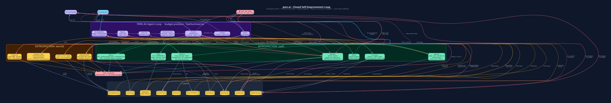
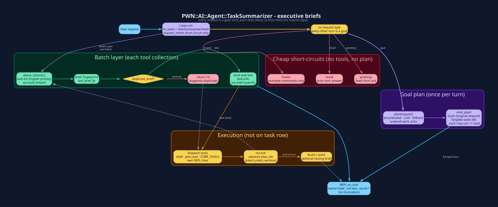

# `pwn-ai` - The Autonomous Agent

`pwn-ai` is a natural-language front end to everything in `PWN::`. You describe
the goal; the agent plans a sequence of tool calls (`pwn_eval`, `shell`,
`memory_*`, `skill_*`, `mistakes_*`, `reward_*`, `curriculum_*`, `extro_*`,
`agent_*`, ...), executes them against the live process, observes the results,
and loops until it can give you a final answer - **learning from every failure
so it doesn't repeat it**.

## Two ways to run it

```text
# 1. Interactive curses console (inside the pwn REPL)
pwn[CURRENT_VERSION]:001 >>> pwn-ai
# Or launch directly from the shell:
pwn-ai
```

The interactive default is a single-owner curses screen: a provider/model
and session header, scrollable typed timeline (OPERATOR, TASK, TOOL, RESULT,
ASSISTANT and WARNING), a persistent multiline composer, and an operational
sidebar at 100 columns or wider. Narrower screens give the timeline the full width.
At 100 columns × 26 rows or larger, the header may carve out a bordered retro-game
colored Unicode-block animation on the left: falling tetrominoes with line clears,
a connected snake eating food and growing, Pong with small tracking paddles and a
bouncing ball, or Asteroids with a rotating cyan ship, red thrust, drifting green
rocks, yellow shots and magenta fragments. Pong's one-cell-high paddles and
quadrant-block ball move in half-cell steps; doubling the presentation rate does
not double gameplay speed. Asteroids wraps at the edges and shots break up rocks;
its seeded autonomous flight is decorative, not player-controlled.
Its framed width in terminal cells equals the complete header's height in rows;
the interior canvas is `(header height - 2)` cells on each side. This is a
cell-square, not a pixel-square—terminal glyph cells are usually taller than wide.
The animation pane has no wordmark; its former label row belongs to gameplay.
The main `pwn-ai` header title and full-screen static banners are unchanged.
Falling blocks fill the entire interior, including the
bottom two quadrants. Each logical block occupies one horizontal half-cell from
spawn through landing and locking. This deliberately replaces independent
quarter-cell blocks: a terminal cell has only a foreground and background, so
two piece colors plus empty black cannot be represented faithfully in four
quadrants. Two horizontal halves always fit that limit, retaining each piece's
color, holes and silhouette instead of recoloring neighbors when they touch.
The board remains full-width; only its horizontal logical resolution changes.
Completed rows intentionally flash white before collapsing; game-over and replay
resets also use white holds/wipes. Ordinary locking never changes color or shape.
Colored falling blocks support interiors up to 64 cells; the other artwork retains
its 16-cell limit. Above the applicable limit, art is centered and padded rather
than clipped or stretched.
One `PWN::Banner.mini_names` animation is randomly
selected for the session and retained across redraws, model changes and resize;
changing the active session selects again. Frames advance at the banner API's
`mini_frame_seconds(name:)` cadence (0.05 seconds for Pong/Asteroids, 0.1 for
blocks/snake) using monotonic time in the existing render loop—no extra animation
thread, input reader or provider call. This is decoration, not progress or
telemetry. The frame keeps the existing border/title theme roles. Artwork comes
from `PWN::Banner.mini_cells(branding: false)` with dedicated foreground/background curses pairs,
not ANSI output or theme overrides. `NO_COLOR` and terminals with too few color
pairs retain occupied geometry in monochrome (two differently colored occupied
halves become a full block, not a half-block with its background lost). The `mini_frame` ASCII API
retains its 60-frame, 0.1-second loops for other callers. Both miniature APIs
default to their legacy branding; `branding: false` reclaims the label row and
leaves undersized fallback panes blank. Colored replays contain
1800 frames (90 seconds for Pong/Asteroids, 180 for blocks/snake), use a local
per-session seed, and share a bounded six-replay cache. Settings
wrap in the right-hand region without losing their label colors. A bounded,
nonrecursive layout pass grows the header and square together. If the terminal
is narrow/short, or that reduced width would clip any setting, the decoration
disappears and settings reclaim the full width.

Accepted `/model` selections (including reasoning effort), session switches and
command-driven setting/theme changes repaint on the event loop without another
keypress. Header wrapping and square geometry follow the current values, even
when a model string is edited in place. Cancelling model selection leaves the
configuration unchanged.

Timestamped entries (`%Y-%m-%d %H:%M:%S%z`), measured request elapsed
time, completed-tool/event counts, and the last observed tool provide operational
context. There are no estimated progress bars. Running
status reflects the request's actual model/tool boundary. Borders are black; the OPERATOR
label, warnings, and the mission prompt are red. Pane titles (`pwn-ai vN`, `SESSION`,
`OPERATIONS`, `MISSION`) use `title`, which defaults to red and is separate from
`border`. The operator's request text is
white. The header grows to show all wrapped settings without shortening or
replacing their text. Only when the terminal cannot fit the full header plus
a one-row timeline, composer and footer does it limit the visible rows; its
title then points to Ctrl+O (or `/status`) for the complete scrollable settings.
State remains visible at every supported size. Header setting labels use the
same `category` color as OPERATIONS labels, including across wrapped lines;
their values retain the `header` color in both the header and details view.
Use PgUp/PgDn, arrows or Home/End there; Esc or Ctrl+O restores the unchanged
draft. The short sidebar prioritizes elapsed time, tools, tokens, cost and last
tool; Ctrl+O exposes the remaining details even without a sidebar.
Assistant text is white, tasks green, tools and notices cyan, and results yellow.
Operations category labels are yellow. Those colors are the default
`ai.tui.theme` in `~/.pwn/pwn.yaml` (`PWN::Env[:ai][:tui][:theme]`). Named curses
colors (`black`, `red`, `green`, `yellow`, `blue`, `magenta`, `cyan`, `white`)
may replace any role; an unknown name keeps that role's default. `NO_COLOR=1`
keeps labels and Unicode borders without color; `TERM=dumb` or non-TTY input/output
uses the existing line interface and explicitly reports the fallback.

| Default color | Theme roles |
| --- | --- |
| black | `border` |
| red | `title`, `operator`, `warning`, `prompt`, `selection` |
| white | `request`, `assistant`, `value`, `composer`, `header`, `footer` |
| green | `task` |
| cyan | `tool`, `notice` |
| yellow | `result`, `category`, `status` |

Fresh configurations and missing roles use these defaults. Existing configured
colors are preserved by runtime resolution and migration/backfill. This palette
changes only default values, not the configuration schema; no migration is needed.

| Key or command | Action |
| --- | --- |
| Enter | Submit the mission |
| Shift+Enter, or trailing `\\` + Enter | Insert a newline. Terminals that cannot distinguish Shift+Enter need `tmux set -s extended-keys on` or the backslash fallback. |
| Up/Down | In MISSION CONTROL, move the completion highlight while the Command menu is visible (wrapping at either end). Otherwise recall requests from `~/.pwn/pwn_history`, including prior runs; Down past the newest restores the draft and cursor. In SESSION, move one transcript row. Esc closes the menu to resume history recall. |
| Home/End | In MISSION CONTROL, move the composer cursor to the start or end of the line. In SESSION, jump to the top of the transcript or back to the live bottom. |
| Ctrl+T | Toggle the active pane between SESSION and MISSION CONTROL. Ctrl+X still toggles. The active title is reversed and marked `active`. Typing or Enter returns to MISSION CONTROL; Enter does not submit while SESSION is active. |
| Ctrl+S or Ctrl+G or `/swarm` | Open the draft-preserving swarm workspace; `/swarm dashboard` also opens it. Ctrl+S still saves inside the system-role editor. |
| Ctrl+P / Ctrl+N | Alternative completion selection keys. In MISSION CONTROL they recall history when no menu is visible. In SESSION they scroll one row. Tab still accepts the highlight. |
| Tab | Accept the highlighted as-you-type parameter |
| Ctrl+O or `/status` | Inspect full status/settings, including overflowing header text; Esc or Ctrl+O closes |
| Ctrl+L | Clear only the Session pane, including while a request runs; preserve stored conversation, token totals, and draft |
| Ctrl+R | Incremental reverse search of request history from `~/.pwn/pwn_history`; repeat for an older match, Enter accepts into the draft without sending, Esc cancels and restores the draft/cursor |
| `/clear` | Clear the session pane only; stored conversation and token totals remain |
| `/verbose [on|off]` | Toggle compact or full tool/notice output |
| `/` + Enter or `/menu` | Open the slash menu |
| PgUp/PgDn | Scroll the timeline; new output does not pull a scrolled viewport to the bottom |
| `/model`, `/sessions resume ID` | Show model settings / change the next request's model or session while idle |
| `/system-role` | Open the active engine's multiline SYSTEM ROLE CONTENT editor while idle; Ctrl+S saves, Esc cancels |
| `/steer INSTRUCTION` | Redirect the active request at a safe boundary |
| `/input TEXT` | Send one line to an ordinary tool stdin prompt; not retained in input recall |
| Ctrl+C | Cancel the active request cooperatively, or clear an idle draft |
| `back`, `/back`, Ctrl+D | Leave the console; if busy, cancel and wait for safe completion first |

Request recall shares Pry's existing `~/.pwn/pwn_history` (append-only plain-text
lines), not a separate console history file or only the current transcript.
Requests are saved through Pry's history owner with its normal duplicate and
save/ignore settings. Multiline input uses Pry's existing line-oriented format.
Search and Up/Down never write history; `/input` tool responses are excluded from
both persistence and recall. Ctrl+L never deletes history or resets token totals.

### System role editor

Choose `/system-role` from the root slash menu (or type it and press Enter).
The **SYSTEM ROLE CONTENT** pane is prefilled with the active engine's exact
text. Enter/Shift+Enter inserts a newline; arrows move the cursor, Home/End
move to the beginning/end of the text, Backspace/Delete edit, and Ctrl+U clears.
**Ctrl+S Save** explicitly accepts the whole text, including an empty value;
**Esc Cancel** or Ctrl+C discards edits. Ctrl+D exits without saving. The editor
owns its keys: Ctrl+R, Ctrl+G, Ctrl+O and Ctrl+L do not activate underlying
history search, swarm, status or clear. The mission buffer and cursor are retained.

Save merges only `ai.<active engine>.system_role_content` into the encrypted
`~/.pwn/pwn.yaml` (or configured vault path), preserving other engines and settings.
It uses the existing decryptor and settings persistence path, encrypting a private
temporary merge before replacing the vault. A failure leaves the previous vault
and live role unchanged and keeps the editor open with **Not saved**; there is
no silent session-only fallback. On success, the header and next request use
the new role immediately, and a new session loads it from the vault. Request or
swarm activity blocks role changes. No schema migration is required. The legacy
non-curses interface reports that this editor requires an interactive terminal.

### Model and reasoning selection

`/model` (also `show` or `status`) displays the current selection. Existing
`/model list`, `/model list llms`, `/model <engine> [model]` and `/model <model>`
forms are unchanged. Submitting a supported model opens a **REASONING EFFORT**
list: Up/Down (or j/k) selects, Enter accepts, Esc/Ctrl+C cancels both changes
and restores the submitted draft. The current effort is preselected when valid;
otherwise the catalog default or the existing medium default is used when
supported. The header updates after acceptance. The legacy interactive line
interface asks the same question (Enter accepts the default; q/Esc cancels).
Noninteractive callers use the valid current/default effort without reading stdin.

OpenAI options come from the model catalog's `supported_reasoning_levels` and
`default_reasoning_level`; catalog discovery happens once on submission, never
while typing. When metadata is absent, explicit documented GPT-5, GPT-5.1/5.2/
5.4/5.5 and GPT-6 Astra API contracts provide fallback options. Astra never offers
`none`. Grok 3 Mini and Grok 4.5/4.6/4.7 use their documented effort levels.
Unknown models without capability metadata and Anthropic, Gemini, Ollama and
OpenWebUI do not offer an effort list: those adapters do not consume this effort
setting (their thinking controls, where present, are different).

Acceptance merges `ai.active`, the selected engine's `model` and its existing
`reasoning_effort` field into the encrypted vault; other settings are retained.
Missing decryptor files leave changes session-only. No schema migration is needed.
Capability references: [OpenAI model pages](https://developers.openai.com/api/docs/models),
[xAI reasoning](https://docs.x.ai/developers/model-capabilities/text/reasoning).

Settings and new requests are rejected while a request is running, rather than
mutating its context concurrently. Network-capable local commands (`/mcp`,
`/cron run`, `/model`) also run off the event thread so `/input` and
exit remain responsive. `/steer` applies to model requests, not these local
commands; cancellation waits until a local command returns.
At less than 48 columns or 14 rows, a compact
resize notice replaces the panes; cancellation and exit remain available. The
screen is repainted after a resize. Request history persists through Pry in
`~/.pwn/pwn_history`. The timeline retains the most recent 2,000 events;
each displayed event is capped at 16 KiB with an explicit truncation notice.
Scrollback stays pinned while new output arrives and shows a new-event count.
The opaque command menu highlights selection even with color disabled. At tiny
sizes hidden submissions are blocked and the draft is preserved until resize.
Slash parameters complete after spaces as well as during typing; Up/Down or Ctrl+P/Ctrl+N
can reach every command, not just the visible menu page. `PWN::` completion lists
constants without loading each candidate's dependencies, and paths complete
outside the usual `/tmp` and `/home` roots too. Tab replaces the token at the
cursor without removing subsequent text. Completion does not fetch provider catalogs.

Describe a concrete outcome in the composer, for example:

```text
Use NmapIt to sweep 10.0.0.0/24, then TransparentBrowser via Burp on hosts
with 443 open, active-scan, and give me a Reports::SAST summary.
```

```bash
# 2. Headless one-shot (CI-friendly)
$ pwn --ai "run bin/pwn_sast against ./src and push findings to DefectDojo"
```

## Swarm workspace

Write a mission in MISSION CONTROL, then press **Ctrl+G**. Nothing runs just
because the workspace opens, an agent is selected, or you navigate. The roster
shows each persona's role, engine and model (including inherited/default values).
It uses the existing Swarm registry and backend, not another agent runtime.

| Workspace key | Action |
|---|---|
| Tab | Switch roster / session-owned jobs |
| j / k | Move the highlighted agent or job; outside this overlay, Up/Down select an open Command menu or recall request history |
| Space | Toggle an agent in the selected set |
| a | Prepare the current mission draft for the highlighted agent |
| b | Prepare a broadcast to the explicitly selected agents |
| d | Prepare a debate among at least two selected agents, in selection order |
| Enter | Open full agent/job details, or execute a displayed confirmation |
| s | On a job, compose a separate steering instruction; Enter reviews, Enter again sends |
| c | On a job, review cancellation; Enter confirms |
| n | Add a swarm-local persona: name, role, then confirm; no provider call |
| r | Refresh the local roster; no remote model catalog lookup |
| PgUp/PgDn, Home/End | Scroll full metadata, results, errors and confirmation text |
| Esc | Abort a prompt/confirmation, leave details, or return to the mission |
| Ctrl+G | Close the workspace immediately, leaving the mission draft and cursor unchanged |

Every action is explicit: inspect the action, targets and text before pressing
Enter on its confirmation. The original draft is never cleared or overwritten
by a swarm action. A new agent inherits routing defaults; use
`/swarm spawn NAME ROLE --engine ENGINE --model MODEL --toolsets a,b` for overrides.
An empty roster offers `n`; an empty jobs tab explains how to launch a mission.

Job details retain observed state, reply/error and the last completed tool for
this console's lifetime. Result text is redacted for display. Broadcasts visit
selected personas sequentially in one owned job; debates pass the previous
speaker's reply into the next turn (one round by default). Separate jobs can
run concurrently, up to eight active jobs. The workspace does not claim a
percentage complete or infer success from time elapsed.

Steering and cancellation affect only the selected owned job. Finished jobs
cannot be steered or revived by cancellation. In the main console Ctrl+C
cancels its active request and owned swarm jobs; Ctrl+D cancels and waits before
leaving. Below the minimum terminal size, hidden actions are blocked but Ctrl+C
and Ctrl+D still work. A running tool finishes cooperatively: neither rollback
nor remote provider billing cancellation is promised. Swarm jobs should use
noninteractive tools; their individual stdin prompts are not multiplexed.

Typed `/swarm roster|status|create|use|spawn|retire|ask|broadcast|debate|tail|steer|cancel`
commands remain available, including parameter completion. These are direct
operator commands and do not add the workspace's extra confirmation step.
`/swarm status JOB` includes retained outcomes. Jobs shown here belong to this
console, not a cross-process durable scheduler.

## Steering a running request

In the interactive native-tool REPL, type a complete line while the agent is
busy:

```text
/steer Stop writing the report. Summarize the evidence already collected instead.
```

This is a **local terminal command**, not Ruby, a model tool, or text appended
to Pry's busy input buffer. `/help` and TAB include `/steer`. An empty command
prints usage; at an idle prompt it reports that there is no active request.

* During the protected model call, a scoped cancellation signal stops the
  local wait and discards the obsolete response. This does not promise that the
  provider stops remote computation or billing. Setup/planning helpers outside
  that window finish before the next cooperative checkpoint.
* During a tool, the notice says **wait until the current tool finishes;
  already-started work is not undone**. No exception is injected into tool
  code. Remaining calls in the obsolete batch are marked not executed, with
  paired tool-result messages, before restarting the loop.
* Instructions are processed FIFO, only in this request/session. Completed
  conversation and tool evidence stay available. The latest explicit user
  instruction takes precedence over conflicting earlier instructions; tool
  output cannot submit steering.
* A steer starts a fresh completion scope from the latest instruction, not a
  keyword-edited reconstruction of the original goal. Include all still-required
  deliverables in that instruction. Old artifact requirements and a supplied
  old verification contract are not silently imposed on the revised task.
  Previously completed work is retained as evidence, not claimed to be undone.

In curses, **only the main event thread draws and reads terminal keys**. One
request-owned worker runs the real `Loop.run`, inheriting PWN request thread
locals, and sends output through an event queue. The existing Steering model
window/checkpoints are reused without starting its canonical stdin reader.
Ordinary tool stdin is a forwarding pipe: explicitly use `/input TEXT`, never
send a bare line that could be mistaken for a new request. Each request gets a
fresh pipe, and cancellation closes it so waiting prompts receive EOF. Ruby
stdout/stderr and the debug tee are captured for the console lifetime, sanitized,
and restored on exit; spinner control sequences are not displayed as notices.
Trace logging remains available, but **ENTER-to-step is disabled** so it cannot
compete for input. Task/tool/result/final rows remain mirrored into request logs.

`Ctrl+C` stops a model wait or requests cancellation at the next tool boundary.
It never asynchronously raises into a side-effecting tool. `back` and Ctrl+D do
the same and keep the UI alive in a closing state until the owned request ends.
The console joins its own worker; it does not kill unrelated threads. A tool
that ignores EOF and has no timeout can delay exit until it finishes. Already
launched durable jobs have their own lifecycle; cancellation does not undo them.

Fullscreen/raw-terminal tools, programs opening `/dev/tty` directly, and code
writing directly to OS terminal descriptors (rather than captured Ruby output
or a tool's returned result) are not supported inside curses. Run those outside
the agent. Stdin temporarily reports non-TTY. Do not expect local cancellation
to stop remote provider computation or billing.

The non-TTY/dumb-terminal legacy line interface retains its foreground Loop and
single canonical steering reader: there, non-command lines are forwarded to
ordinary stdin prompts, and EOF ends the reader. Both paths restore the input
descriptor, its flags, terminal mode and output on cleanup. Restart the REPL
after upgrading these files.

## Anatomy of a turn

1. **PromptBuilder** assembles the system prompt: your request + **engine-budgeted
 blocks** - MEMORY (relevance-ranked via `PWN::MemoryIndex` when a local embedding
 model is reachable) · SKILLS · LEARNING · **KNOWN MISTAKES / KNOWN FIXES** ·
 TOOL EFFECTIVENESS (**per-engine**) · **POLICY** (live Q / REINFORCE snapshot,
 advisory only) · **EXTROSPECTION** (live host fp + drift + fresh observations
 including `:rf` now-playing and `:web` DOM watches) · RECENT TURNS. `PromptBuilder.budget`
 shrinks each block for local engines so a small model spends its attention on the
 task, not the harness.
2. **Loop** checks the incoming message against `Mistakes::CORRECTION_RX` - if
 it reads like *"no, that's wrong"* the previous outcome is flipped to
 `success:false`, fingerprinted, **and recorded as a `(prompt, rejected,
 chosen)` DPO preference pair** in `~/.pwn/preferences.jsonl`.
3. **Registry** hands Loop the tool schemas - the full set for frontier
 engines, or `CORE_TOOLS` + top-K keyword-relevant when
 `ai.agent.tool_router` is on (default on for `ollama` / `openwebui`). Rank
 can include a Q-advantage term from `Policy` after a pair has been visited
 at least twice, plus `ai.agent.tool_preference` as a smaller tie-break.
 Planning still owns the task list. *(local)* `Learning.exemplars_for` splices a compressed
 prior-success trace as few-shot; *(local)* `plan_first` forces a numbered
 tool plan before the first dispatch (optionally red-teamed by
 `Curriculum.red_team_plan`).
4. **TaskSummarizer** (if `ai.agent.task_summary` is on, default true):
 `emit_plan!` prints the full goal + numbered tangible tasks once on
 submit. Before each tool *collection*, `about_to` emits a single
 `name='task'` brief built from `capability_label` +
 `tool_counts_phrase` + `intent_phrase` (e.g. `search`/`edit`/`read`/
 `test`/`mutate-ruby`), tied to the active plan item. Identical briefs
 are suppressed via `last_brief_fp` (returns `nil` → no second line).
 Full goal text is **not** restated on every batch when a plan exists.
 `Loop.task_summary_about_to!` is the sole about_to entry path.
5. Loop opens a **Policy** episode (`begin_episode`) so live Q / REINFORCE can
 advise rank on this turn, then sends the prompt to the active `PWN::AI::<Engine>`
 client.
6. Provider replies with `tool_calls` → **Dispatch** executes each one via the
 [Registry](Agent-Tool-Registry.md). **ToolGuard** runs first on `shell` and
 `pwn_eval`: it maps common wrong keys (`value`/`cmd`) onto the schema, drops
 placeholder payloads (`...`, `{...}`), refuses bash-only syntax unless
 `ai.agent.shell_bash` is on. **Metrics** records
 `duration/success/engine` (via `Reward.semantic_ok` - `grep` exit 1 ≠
 failure); **Policy.observe_step** records the hygiene reward for that tool. Dispatch is *tolerant* - Levenshtein-repairs near-miss tool names
 and cleans up almost-JSON args, fingerprinting every repair into
 **Mistakes**. Any *failure* is fingerprinted (`count++`, cross-session) and
 the tool result gets an inline `correction_hint`
 (`seen N×, sig=..., KNOWN FIX: ...`) so the very next iteration
 self-corrects. If the persistent count ≥ 3, `guard_repeated_failure`
 interrupts with an explicit *change-approach* instruction (optionally
 forking a `Curriculum.counterfactual` A/B branch). *(local)* once in-turn
 failures ≥ `ESCALATE_AFTER_FAILS`, `Loop.escalate` asks the
 `ai.agent.escalation_persona` Swarm persona for a 3-line frontier hint and
 injects it as a synthetic tool result. On-demand sense tools
 (`extro_verify` / `extro_watch` / `extro_rf_tune` / `extro_osint` /
 `extro_serial` / `extro_telecomm` / `extro_packet` / `extro_vision` /
 `extro_voice` / `extro_intel`) fire here when the question needs the
 outside world; a `:refuted` verify is itself recorded as a Mistakes
 `assumption` fingerprint.
7. Results are appended to the message list; go to 5.
8. When the reply has *no* tool_calls it's the **final answer**. With
 `defer_introspect` on (default), the user-visible reply returns first and
 `Learning.auto_introspect` runs on a background thread. Specs and cron stay
 inline. Then *(local)*
 `fact_check_local_final` auto-`extro_verify`s every CVE / version-shaped
 claim in the answer; **`Reward.judge`** scores (request, final) with a cheap LLM ORM →
 `{score, verdict, rationale, source}` (heuristic overlap only if the engine is unavailable); **`Policy.finish`** applies that judge score as
 the terminal reward and updates Q / REINFORCE; **`Reward.prm`** back-labels each transcript
 step with `step_reward:+1/0/-1`; failed goals are optionally HER-relabeled
 by `Curriculum.hindsight`; `Reflect.on` writes durable lessons via
 `ai.reflect_engine` (teacher-student - a frontier engine may author the
 lesson a local engine reads); `Reward.sentinel` warns when success_rate ≠
 judge_mean ≠ (1 - user_correction_rate); when `auto_extrospect` is also on,
 `Extrospection.auto_extrospect` runs (`AUTO_SECTIONS = host/repo/env` only -
 never toolchain/rf/web, never launches Burp/ZAP/msf/gqrx). Transcript is
 flushed to `~/.pwn/sessions/`.



After the reply, `Learning.auto_introspect` calls `rsi_tick`. That tick reads ESR (`verified_exploit_tools / vulnerable_tools`) and ASR (`successful_attacks / total_attack_attempts`) from `Metrics`. A lower ESR than the previous snapshot becomes a lesson tagged `rsi`. Scanner output does not feed those rates. `Findings.verify` does, and only when the stored PoC's transcript contains the impact string.

## What the agent can call

16 toolsets · **150 tools** - full table at
[Agent Tool Registry](Agent-Tool-Registry.md).

The two that matter most:

| Tool | Reach |
|---|---|
| `pwn_eval` | **Any** Ruby in-process - the whole `PWN::` namespace, `require`, monkey-patch, everything |
| `shell` | **Any** OS command on the host. Runs through `PWN::AI::Agent::ToolGuard` first (placeholder, schema, bash-only syntax). |

Everything else (memory, skills, learning, **mistakes**, **reward**,
**curriculum**, **policy**, extrospection, cron, swarm, sessions, metrics) is a
convenience wrapper the model can discover from the schema alone.

## Delegating to other agents

`agent_ask`, `agent_debate`, `agent_broadcast` spin up **sub-agents** (each a
full `Loop.run` under a persona overlay) that share a JSONL bus. See
[Swarm](Swarm.md).


## Task summaries (long autonomous turns)

`PWN::AI::Agent::TaskSummarizer` keeps the TUI readable during multi-step work.
There is no request type. Every request gets an English task compass.

| Surface | When | Content |
|---|---|---|
| `emit_plan!` | User submit | **Full** goal + ordered plain-English tangible tasks (each may need many tools) |
| `about_to` | Before each tool batch | **Primary:** `task k/n: <english>` - **secondary:** `via shell×2 (search)` (not raw argv) |
| `plan_context` / `active_task_prompt` | Into Loop messages | Same English tasks steer tool choice (not TUI-only) |
| `record!` | After each tool | Advances `plan_idx`; emits English advancement brief when the index moves; verbose progress only if `task_summary_verbose` |
| `flush!` | End of turn | Optional closing brief with active `task k/n` |

**Dedup rules (operational):**

- Fingerprint = whitespace-normalized brief; `last_brief_fp` match → return `nil` (no emit).
- Intent verbs distinguish batches that share tools (`shell` search ≠ `shell` edit).
- Goal string only on the plan line when a plan exists (`why_bit(with_goal:)` when no plan bit).
- Advancement needs a PRM +1 streak or a clear phase shift after tools on the active task (not a blind every-3-tools hop).
- REPL contract: `on_tool.call('task', full_summary_text, '')` - result empty, no truncation.

**Long-run pressure:** Loop.run does not abort on a round cap. Keep CORE_TOOLS until `may_finalize?`. Budget-hot turns skip extra counterfactual forks. Ctrl-C stops the turn.



Config (`~/.pwn/pwn.yaml` → `ai.agent`):

```yaml
task_summary: true              # master switch (default on)
task_summary_every: 5           # verbose progress every N tools
task_summary_interval_s: 8.0    # or every N seconds (verbose)
task_summary_verbose: false     # mid-flight Progress: lines
task_summary_llm: true          # LLM task decompose (default on)
max_iters: 777                  # scars / overconf do not lower this request
```


## Tips

- SHIFT+ENTER = newline, ENTER = submit.
- `back` / `exit` returns to the plain REPL.
- Disable `auto_introspect` during noisy fuzz loops
  (`learning_auto_introspect_toggle(enabled: false)`), re-enable for the
  summary turn.
- Run `mistakes_list` before retrying something that failed last session -
  the fix may already be recorded.
- Leave `ai.agent.tool_router` and `ai.agent.plan_first` on auto when running
  a local model - that cuts mis-routing a lot. Tune `ai.agent.tool_preference`
  if you want recall / sessions ahead of `shell` on ties.
- Set `ai.reflect_engine:` to a frontier provider so lessons written to
  `~/.pwn/memory.json` stay high-signal even when the executing engine is
  local.
- `PWN::AI::Agent::Learning.export_finetune` and `Reward.export_dpo` turn
  successful sessions and preference pairs into supervised / preference
  datasets under `~/.pwn/finetune/`. `Curriculum.train_and_gate` can then
  fine-tune a local model and promote only when resolved-mistake margin,
  mean judge score, and a frozen smoke set all look healthy. Preference
  pairs should be real answer revisions and winning traces, not fix-commentary
  prose. `scrub_preferences` and the export filter enforce that.
  See [Reinforcement Learning](Reinforcement-Learning.md).

## RL feature flags (`PWN::Env[:ai][:agent]`)

| Flag | Default | Effect |
|---|---|---|
| `critic` / `counterfactual` / `red_team_plan` | `nil` (auto) | ON for remote engines, OFF for ollama |
| `hindsight` | `true` | HER soft-relabel on failed turns |
| `policy` | `true` | Live tabular Q / REINFORCE. Advisory rank only. `false` disables. |
| `reward_llm` | `nil` (auto) | outcome/process judges use a cheap LLM teacher on remote even when `module_reflection` is false |
| `reward_model` | `nil` | optional cheaper model id for `Reward.judge` / `.prm` (nil = active engine default) |
| `reward_llm_timeout` | `12` | seconds for the cheap ORM chat (clamped 2..30) |
| `verify_as_reward` | `nil` (auto) | browser-grounded claim sample policy |
| `local_introspect` | `:failure_only` | ollama / openwebui end-of-turn introspect policy |
| `tool_preference` | same list as CORE_TOOLS (`memory_recall`, `session_recall`, `skills_recall`, `pwn_eval`, `shell`, `mistakes_record`, `mistakes_resolve`, `learning_note_outcome`, `memory_remember`, `skills_update`) | Rank bonus + Policy suggested-action order |
| `defer_introspect` | `true` | Post-answer Learning on a background thread |
| `prompt_cache` | `true` | Engine-native prefix cache (not Ollama / Open WebUI) |

Full detail: [Reinforcement Learning](Reinforcement-Learning.md).

**See also:** [AI Integration](AI-Integration.md) ·
[Skills, Memory & Learning](Skills-Memory-Learning.md) ·
[Mistakes](Mistakes.md) · [Reinforcement Learning](Reinforcement-Learning.md) ·
[Extrospection](Extrospection.md) · [Swarm](Swarm.md) · [Cron](Cron.md)

[← Home](Home.md)

## Intent routing

There is no request type. Greeting / howto / recall still use `request_intent`
for cheap short-circuits. Everything else is a goal: TaskSummarizer compass + CORE_TOOLS.

| Intent | Example | Behavior |
|--------|---------|----------|
| How-to | "how to do a ping sweep of a subnet using hping3?" | Short explanation with example commands only. No tools. |
| Greeting | "Howdy, it's cloudy." / "hi" | Fixed short ack. No tools, no LLM, no weather echo. |
| Recall | "what did I just say?" / "how did you respond?" | Cheap prior-turn answer from the session transcript. |
| Goal | "refactor Loop.run" / "find live hosts on this subnet" / "what color is a cherry" | Task compass + CORE_TOOLS. There is no statement/question type. |

On how-to asks, memory SOPs about repo rubocop/rake hygiene are
kept out of the prompt so the model does not pivot into unrelated verification.

Keyword routing, unfinished-goal resume (`continue` / `resume`), and
write-then-read completion: [Session Workflow](Session-Workflow.md).

[← Home](Home.md)

